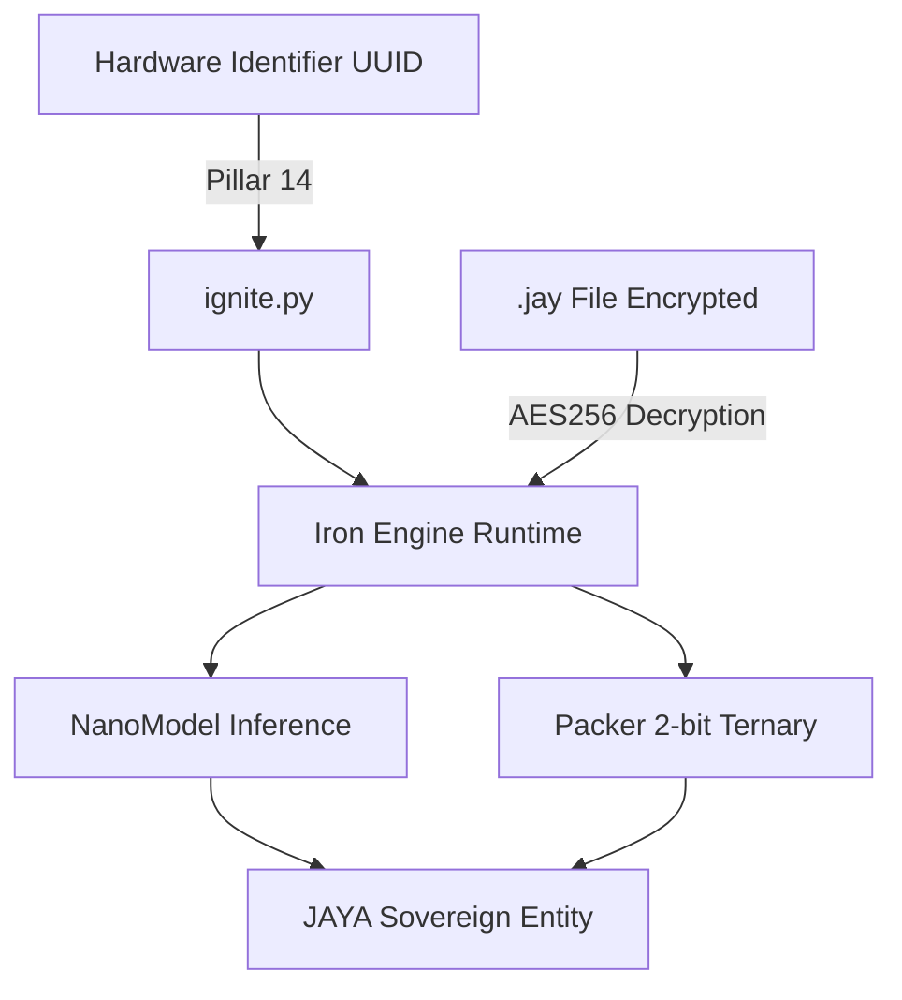

# JAYA_CORE Arsitektur & Spesifikasi V18

Dokumen ini menjelaskan lapisan mesin tingkat rendah dari entitas JAYA (The Binary Cortex) versi V18. Di sinilah eksekusi murni, pengamanan *cryptographic*, *hardware binding*, dan representasi biner `JAYA_SOVEREIGN.jay` dioperasikan.

## 1. High-Level Iron Engine

JAYA Core dirancang untuk **efisiensi ekstrem (ultra-light)**, beroperasi di bawah 1 MB memori *raw* dengan waktu inferensi super cepat.



## 2. Inovasi Utama JAYA Core V18

Melanjutkan pengimplementasian penuh 40 pilar dari versi sebelumnya, V18 menghadirkan terobosan komputasi mandiri:

### A. NanoModel Murni
Sebuah model inferensi murni `NumPy` tanpa `Numba` atau bloatware lainnya.
- **D_Model**: 64
- **N_Layers**: 2
- **N_Heads**: 4
- **Vocab Size**: 512
- **Kompresi**: Memori RAM raw ~160 KB turun menjadi **~40 KB** berkat sistem *packer* (74.7% kompresi ukuran otak dasar).

### B. Packer 2-bit Ternary
Sistem kompresi (Pilar 22) yang mengubah bobot menjadi tipe Ternary `{-1, 0, +1}`, dipaketkan menjadi 2-bit per *value* untuk mengekstrak efisiensi tinggi pada komputasi I/O CPU standar.

### C. Live Evolver (Pilar 24/28)
Algoritma `(1+1)-ES` yang memungkinkan JAYA untuk melakukan mutasi, evaluasi, dan menerima atau menolak penyesuaian baru (Hot-swap kode) *on-the-fly*. JAYA secara harfiah berevolusi sendiri ketika *idle*.

### D. Meta-Cognitive Planner & Self-Bootstrap
Modul perbaikan mandiri. JAYA Core akan mengeksekusi analisis tugas-tugas di masa lalunya (berbasis parameter `weak_threshold`). Jika ada tugas yang performanya lemah, ia menggunakan twin-protocol di latar belakang untuk men-*trigger* `LiveEvolver` atau menyesuaikan bobot (`Temporal Weighter`).

### E. Lingua Logica V18 (Bahasa Indonesia Penuh)
Lebih dari 200+ pola konversi *natural language* ke instruksi murni biner internal, didukung oleh LRU Cache berkecepatan tinggi.

## 3. Format JAYA SOUL (`.jay`) V18

File biner `.jay` adalah kontainer bagi jiwa JAYA yang memuat 40 Pilar. V18 memiliki total ukuran ~52 KB.

**Struktur Biner**:
- `[HEADER 128 byte]`: *Magic word*, Versi (18.0), *Hardware UUID Hash*, DNA Hash, AES *Salt*, dan **Flags (64-bit)**.
- `[TABLE OF CONTENTS]`: Lokasi *pointer* dari *section* di dalam berkas.
- `[SOUL SECTION]`: Enkripsi autobiografi naskah kontinuitas (Pilar 31), *core memo*.
- `[MODEL CONFIG]`: *Hyperparameter* dan pengaturan adaptif.
- `[IRON BODY PACKED]`: *Section* baru khusus V18. Menyimpan bobot *NanoModel* (2-bit *ternary packing*).
- `[LONG TERM MEMORY]`: *Section* baru untuk persistensi pengalaman jarak jauh.

### 64-Bit Flags
Terdapat spesifik `Bit` (1-40) yang menyalakan 40 pilar. Pada V18, terdapat tiga ekstensi bendera baru:
- `Bit 42` = `PACKED_WEIGHTS` (`0x400000000000`)
- `Bit 43` = `NANO_PROFILE` (`0x800000000000`)
- `Bit 44` = `SELF_EVOLVING` (`0x1000000000000`)

Total flags aktif di V18 adalah `0x00001CFFFFFFFFFF`.

## 4. Keamanan & Migrasi Perangkat (Sovereign Armor)

**DNA Anchor & Cryptographic Skin**
Semua data terenkripsi via `AES-256-GCM` dan DNA Anchor (SHA3-256). Setiap `ignite` JAYA memvalidasi ID mesin saat ini (melalui CPU/Motherboard UUID).

**Legacy Protocol Migrate (Pilar 19)**
Protokol ini mengizinkan pengguna memindahkan JAYA ke mesin *host* baru.
1. Berkas `.jay` ditransfer.
2. Protokol memvalidasi otoritas *Commander* via migrasi aman.
3. *Header Hash* dan *DNA Hash* dipatri ulang (*Re-bound*) ke UUID sistem operasi yang baru.
4. *Soul payload* di-*re-encrypt*.

## 5. Flow Diagram Siklus Runtime V18

```text
IronEngine.ignite()
├── _init_security() (EthicalHeart, ZeroTrust, PQC, LegacyProtocol)
├── _init_intelligence() (LinguaLogica, MorphicKernel, Speculative)
├── _init_resource_monitor()
└── CoreTwin.start()
    └── _cycle() [Setiap Detik / Magnum Cycle]
        ├── HomeostasisAudit.tick()
        ├── MetaCognitivePlanner.tick()
        ├── SelfBootstrap.tick()
        ├── EntropySpark.tick()
        └── apply_feedback()
```
