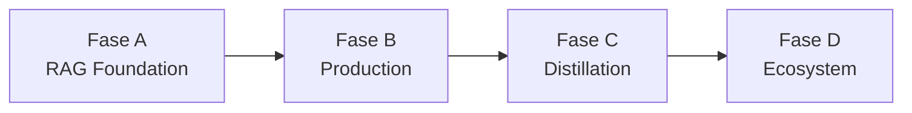

# Roadmap Pengembangan JAYA — Fase A hingga D

> Dokumentasi perencanaan implementasi berdasarkan analisis gap sistem (Juni 2025). Setiap fase punya dokumen induk dan workflow anak dengan checklist penyelesaian.

---

## Gambaran Umum

```
Fase A (1–2 minggu)   RAG Foundation        → Perbaiki inti retrieval & endpoint hilang
Fase B (2–3 minggu)   Production Readiness  → Session persist, streaming, eval formal
Fase C (~1 bulan)     Distillation & Edge     → Dataset, eval student, integrasi lokal
Fase D (ongoing)      Ecosystem Bridge        → CORE↔RESEARCH, multimodal, voice
```



**Aturan penyelesaian fase:** Fase dianggap **selesai** hanya jika **semua checklist** di setiap workflow anaknya tercentang (`[x]`) dan kriteria verifikasi fase terpenuhi.

---

## Indeks Fase

| Fase | Fokus | Estimasi | Dokumen Induk |
|------|-------|----------|---------------|
| **A** | Restore Enhanced RAG, ingest, endpoint API | 1–2 minggu | [phase-a-rag-foundation.md](phase-a-rag-foundation.md) |
| **B** | Ketahanan produksi & benchmark formal | 2–3 minggu | [phase-b-production-readiness.md](phase-b-production-readiness.md) |
| **C** | Distilasi, evaluasi, student model lokal | ~1 bulan | [phase-c-distillation-edge.md](phase-c-distillation-edge.md) |
| **D** | Jembatan ekosistem & fitur lanjutan | Berkelanjutan | [phase-d-ecosystem-bridge.md](phase-d-ecosystem-bridge.md) |

---

## Workflow Anak per Fase

### Fase A — RAG Foundation

| ID | Workflow | Dokumen |
|----|----------|---------|
| A.1 | Restore Enhanced RAG (FAISS + workspace filter) | [workflows/phase-a/a1-enhanced-rag-restore.md](workflows/phase-a/a1-enhanced-rag-restore.md) |
| A.2 | Pipeline ingest dokumen & thesis | [workflows/phase-a/a2-ingest-pipeline.md](workflows/phase-a/a2-ingest-pipeline.md) |
| A.3 | Implementasi endpoint API yang hilang | [workflows/phase-a/a3-missing-endpoints.md](workflows/phase-a/a3-missing-endpoints.md) |

### Fase B — Production Readiness

| ID | Workflow | Dokumen |
|----|----------|---------|
| B.1 | Persistensi session thesis | [workflows/phase-b/b1-session-persistence.md](workflows/phase-b/b1-session-persistence.md) |
| B.2 | Progress streaming analisis background | [workflows/phase-b/b2-progress-streaming.md](workflows/phase-b/b2-progress-streaming.md) |
| B.3 | Benchmark & evaluasi formal PDF QA | [workflows/phase-b/b3-formal-benchmark.md](workflows/phase-b/b3-formal-benchmark.md) |

### Fase C — Distillation & Edge

| ID | Workflow | Dokumen |
|----|----------|---------|
| C.1 | Perluasan dataset distilasi | [workflows/phase-c/c1-dataset-expansion.md](workflows/phase-c/c1-dataset-expansion.md) |
| C.2 | Evaluasi & validasi student model | [workflows/phase-c/c2-student-evaluation.md](workflows/phase-c/c2-student-evaluation.md) |
| C.3 | Integrasi student model ke JAYA_RESEARCH | [workflows/phase-c/c3-local-student-integration.md](workflows/phase-c/c3-local-student-integration.md) |

### Fase D — Ecosystem Bridge

| ID | Workflow | Dokumen |
|----|----------|---------|
| D.1 | Unified chat router (lokal vs cloud) | [workflows/phase-d/d1-unified-router.md](workflows/phase-d/d1-unified-router.md) |
| D.2 | Sinkronisasi knowledge CORE ↔ RESEARCH | [workflows/phase-d/d2-knowledge-sync.md](workflows/phase-d/d2-knowledge-sync.md) |
| D.3 | Evolution UI & registry live | [workflows/phase-d/d3-evolution-ui.md](workflows/phase-d/d3-evolution-ui.md) |
| D.4 | Multimodal PDF ingest | [workflows/phase-d/d4-multimodal-pdf.md](workflows/phase-d/d4-multimodal-pdf.md) |
| D.5 | Voice agent terintegrasi UI | [workflows/phase-d/d5-voice-integration.md](workflows/phase-d/d5-voice-integration.md) |

---

## Cara Menggunakan Checklist

1. Buka dokumen fase induk (mis. `phase-a-rag-foundation.md`).
2. Kerjakan workflow anak **berurutan** kecuali disebutkan paralel.
3. Centang item di dokumen workflow anak saat selesai: `- [ ]` → `- [x]`.
4. Jalankan verifikasi di bagian **Kriteria Selesai** workflow tersebut.
5. Kembali ke dokumen induk; centang ringkasan workflow di master checklist fase.
6. Fase selesai jika semua workflow anak + kriteria verifikasi fase terpenuhi.

---

## Prasyarat Global

- [ ] Python 3.10+ dan Node.js 18+ terpasang
- [ ] `NVIDIA_API_KEY` dikonfigurasi di `.env`
- [ ] Backend (`research_api.py`) dan UI bisa dijalankan lokal
- [ ] Akses baca ke `JAYA_CORE/` untuk fase C dan D

---

## Referensi Terkait

- [Benchmark PDF QA v1–v6](../04-development/pdf-qa-benchmark.md)
- [RAG Chat](../03-features/rag-chat.md)
- [API Reference](../02-architecture/api-reference.md)
- [QLoRA Pipeline](../05-research-notes/qlora-pipeline.md)
- [JAYA_CORE Registry](../../../JAYA_CORE/data/policies/registry.json)

---

*Terakhir diperbarui: Juli 2025*
