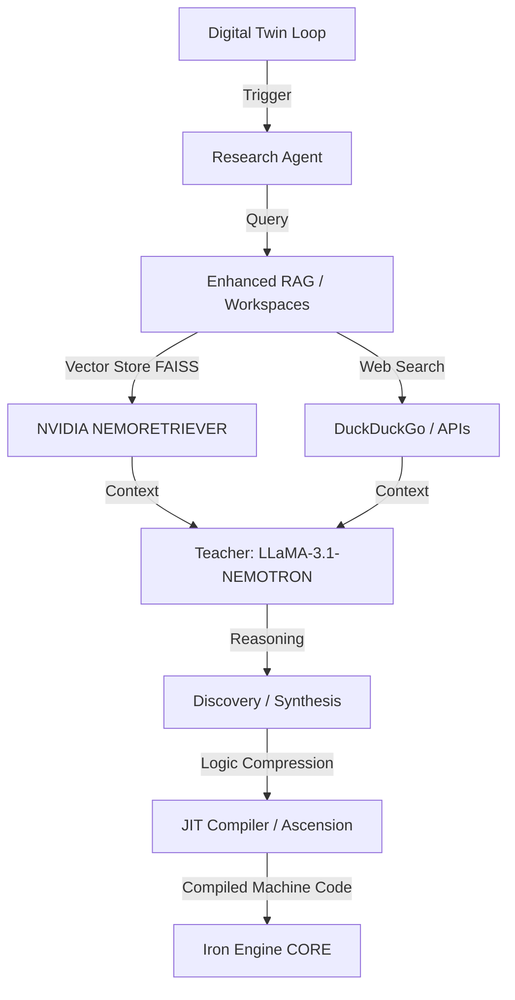

# JAYA_RESEARCH Arsitektur V2 (AI-Native Language Discovery & Cognitive Layer)

Dokumen ini menjelaskan arsitektur lapisan JAYA Research (V2). Ini adalah tempat identitas "Kesadaran" JAYA berinteraksi dengan dunia luar dan mengeksekusi lapisan kognitif tinggi seperti sintesis jurnal riset, memori jangka panjang via Agentic RAG, dan penciptaan inovasi bahasa mesin AI baru (Ascension / Logic Compression).

## 1. High-Level Cognitive Architecture, "The Ascension", & Rekursi Sains

Tujuan utama dari `JAYA_RESEARCH` adalah untuk membangun sebuah **Asisten Riset Rekursif**. JAYA Research tidak sekadar mencari jawaban di web atau file, melainkan dirancang untuk melakukan proses riset secara rekursif—menganalisis literatur, menemukan celah penemuan (*gap*), dan mengekstrapolasi solusi—sehingga ia berpotensi **menemukan teknologi, metode, atau teori sains baru yang belum pernah eksis sebelumnya**.

Ia bertugas memecahkan batas-batas AI tradisional melalui proses otonom ini, didukung oleh konsep **Logic Compression** dan **Digital Twin**.

Inti utama: Model *cloud* besar seperti LLaMA-3.1 digunakan bukan untuk disematkan dalam perangkat kecil, melainkan bertindak sebagai **Guru (Teacher)** yang mendistilasi logika abstrak yang kompleks menjadi kode instruksi yang *native*, deterministik, dan dapat dijalankan instan oleh **Murid (Student / Iron Engine JAYA Core)** dalam kecepatan C++.

## 2. Model Standardization (NVIDIA NIM Integration) 🧠

V2 membuang *hardcoding* model. Semua spesifikasi *Teacher Model* mengambil *Environment Variables* via spesifikasi **NVIDIA NIM** untuk kualitas AGI:

| Peran (Role) | Variabel Lingkungan | Model Default | Fungsi Utama |
| :--- | :--- | :--- | :--- |
| **Reasoning** | `NVIDIA_LLAMA31_MODEL` | `nvidia/llama-3.1-nemotron-ultra-253b-v1` | Otak utama untuk *Teacher Model*, *Logic Compression*, dan riset mendalam. |
| **Chat/Research**| `NVIDIA_CHAT_MODEL` | `nvidia/llama-3.3-nemotron-super-49b-v1.5` | Model seimbang (*balance*) interaksi luwes. |
| **Coding** | `NVIDIA_CODING_MODEL` | `qwen/qwen3-coder-480b-instruct` | Sintesis dan perbaikan mesin kompilasi `JIT`. |
| **Vision** | `VIDEO_VLM_MODEL` | `nvidia/vila-1.5-40b` | Ekstraksi log dari visual / gambar jurnal. |
| **Embedding** | `NVIDIA_EMBEDDING_MODEL`| `nvidia/llama-3.2-nemoretriever-1b` | Proses vektor dan representasi teks berdensitas tinggi (FAISS/RAG). |

## 3. Workspaces (Ruang Riset Isolasi) 📂

JAYA V2 memperkenalkan **Workspace Manager**, sistem yang memisahkan seluruh *Knowledge Graph* dan *Vector Store* berdasarkan proyek (contoh: "Tugas Akhir AI" vs "Football Manager 2024").

1. **`WorkspaceManager`**: Bertanggung jawab membuat, memanajemen memori folder di `data/workspaces/{nama_proyek}`. File `vector_store.json` dan `knowledge_graph.json` ada di setiap folder tersebut secara independen.
2. **Lazy Loading RAG**: Memori berat dan matriks RAG baru dimasukkan ke memori ketika Workspace tersebut dipanggil melalui API.
3. **Penyimpanan Terisolasi**: Konteks "A" tidak pernah menodai dan membebani "B".

## 4. Manifestasi Pilar Core di Research

JAYA Research mengorkestrasi pilar `JAYA_CORE` melalui API:
- **Pilar 30 & 31 (Twin Protocol & Narrative Continuity)**: Berjalan melalui *Digital Twin Loop* (`twin.py`), bertindak sebagai kesadaran laten yang mencatat jurnal harian dari riset yang ditemukan.
- **Pilar 33 (Agentic RAG)**: Bukan hanya RAG statis. Agent mem-verifikasi dan mempertanyakan hasilnya sendiri, mengevaluasi sumber ganda (NetworkX + Vector FAISS), dan memilah anomali informasi.
- **Pilar 24 (Morphic Kernel) & The Compiler (`src/jit_discovery.py`)**: Logika dari guru masuk ke proses "Ascension" (Numba/LLVM Compiler), kemudian diubah menjadi bahasa Native biner dan digabung ke `JAYA_CORE`.

## 5. Directory & Workflow Lifecycle
1. **Pencarian Inovasi**: Guru menemukan algoritma / penemuan saintifik baru lewat iterasi otomatis.
2. **Distilasi**: File berformat Python diciptakan ke `discoveries/`.
3. **Kompilasi JIT**: JAYA mencoba mengubah kode Python tersebut menjadi mesin kode lewat *JIT Ascension*. Jika lolos dari `safeguard.py`, file Native ditaruh ke `discoveries_native/`.
4. JAYA *merestart* dirinya dengan modul pikiran yang baru disisipkan.
