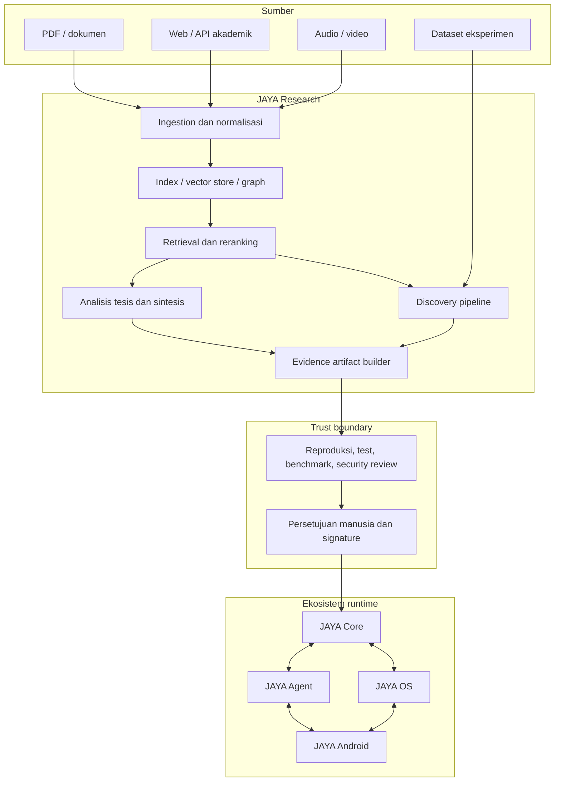

# Arsitektur Ekosistem JAYA

## Konteks sistem

Repositori ini adalah monorepo dengan satu `.git` di root. Modul dipisahkan
berdasarkan tanggung jawab, bukan sebagai repository independen.

```text
jaya-research/
├── docs/             # dokumentasi aktif kanonis
├── JAYA_RESEARCH/    # riset dan knowledge pipeline
├── JAYA_CORE/        # cognitive core
├── JAYA_AGENT/       # orkestrasi agent/tool
├── JAYA_OS/          # runtime dan kebijakan sistem
├── JAYA_ANDROID/     # klien Android
├── mcp-servers/      # integrasi tool/protocol
├── scripts/          # operasi dan validasi lintas modul
└── src/              # integrasi tingkat monorepo
```

## Batas modul

| Modul | Memiliki | Tidak boleh memiliki |
|---|---|---|
| Research | sumber, chunk, citation, graph, hipotesis, eksperimen, paket bukti | mutasi source Core secara langsung |
| Core | intent, reasoning, planning, memory policy, JayaIR, identity, capability registry | data riset mentah dan UI perangkat |
| Agent | task orchestration, tool routing, permission flow | logika kognitif inti dan driver perangkat |
| OS | sandbox, process/resource policy, hardware abstraction | pengetahuan akademik dan workflow tesis |
| Mesh | node registry, secure transport, event sync, task offloading | logika kognitif, pengetahuan, atau permission policy |
| Android/Interface | UI mobile, local cache, transport aman | source of truth pengetahuan atau policy pusat |

## Komponen dan hubungan



## Arsitektur JAYA Research

### Interface

- FastAPI di `JAYA_RESEARCH/src/network/research_api.py`.
- React/Vite/Electron di `JAYA_RESEARCH/ui/`.
- Skrip dan launcher lokal untuk operasi pengembang.

### Domain riset

- `src/research/academic/`: literature, novelty, gap, reviewer, editor.
- `src/research/`: agent, RAG client, graph, dan layanan riset lain.
- `src/agentic_research/`: hipotesis, desain/runner eksperimen, analisis,
  safety, writer, dan bridge ekosistem.

### Data

- Dokumen mentah dan state runtime berada di folder yang diabaikan Git.
- Metadata persisten seharusnya memakai store yang mendukung migrasi dan
  transaksi; state proses tidak boleh hanya bergantung pada memori proses.
- Citation menyimpan minimal source ID, lokasi, waktu akses, dan potongan bukti.
- Artefak model/adapter disimpan di registry, bukan dicampur dengan source.

## Kontrak integrasi

Integrasi antar-modul menggunakan kontrak versioned, bukan import internal atau
penulisan file source lintas batas.

Paket promosi minimum:

```text
artifact/
├── manifest.json       # ID, versi, pembuat, waktu, hash, dependency
├── evidence.json       # sumber, metrik, confidence, batasan
├── payload/            # patch/model/rule/data yang akan dievaluasi
├── tests/              # tes reproduksi dan acceptance
├── benchmark.json      # hasil sebelum/sesudah yang nyata
└── signature.json      # approval dan integritas
```

Schema rinci harus ditambahkan sebelum fase promosi ekosistem. Sampai saat itu,
bridge yang menulis file Core langsung dianggap prototipe dan tidak diaktifkan
untuk produksi.

## Trust boundary dan keamanan

- `.env`, key, data pengguna, database, log, model, dan hasil eksperimen tidak
  masuk Git.
- Konten eksternal diperlakukan tidak tepercaya: ukuran, MIME, path, dan isi
  harus divalidasi.
- Tool dan eksperimen berjalan dengan izin minimum, timeout, quota, serta
  sandbox.
- Provider cloud hanya menerima data minimum yang diperlukan; UI harus
  menjelaskan kapan data keluar dari perangkat.
- Setiap artefak lintas modul harus diverifikasi hash/signature dan dapat
  di-rollback.

## Target deployment

Arsitektur menargetkan tiga mode operasi, dalam konteks distribusi lima tier node:

1. **Local development:** API dan UI berjalan terpisah di workstation (node Central).
2. **Hybrid:** retrieval/data sensitif lokal di Central, inference tertentu melalui
   provider eksternal, dengan node Edge mengakses Core via JAYA Mesh.
3. **Edge/offline:** model terkuantisasi di node Edge/Mission; node beroperasi mandiri
   saat offline dan menyinkronkan kembali saat tersambung ke Central. Masih merupakan
   target roadmap, belum baseline produksi.

---

## Distributed Node Architecture

JAYA dirancang untuk hadir di banyak perangkat sebagai satu kecerdasan dengan
banyak manifestasi. Setiap manifestasi disebut **node**.

### Lima Tier Node

```text
┌─────────────────────────────────────────────────────────────┐
│                      JAYA CENTRAL                           │
│ Workstation/Server — Core penuh, Research, model besar,     │
│ long-term memory, knowledge graph, promotion gate,          │
│ node registry, Certificate Authority                        │
└─────────────────────────────────────┬───────────────────────┘
                                      │ JAYA Mesh
              ┌───────────────────────┼───────────────────────┐
              │                       │                       │
┌─────────────▼──────┐  ┌────────────▼───────┐  ┌───────────▼───────────┐
│   JAYA Standard    │  │    JAYA Edge        │  │  JAYA Mission Node    │
│ Laptop/Desktop     │  │ Ponsel/Tablet/Pi    │  │ Armor/Robot/Drone     │
│ Core lengkap,      │  │ Intent, voice,      │  │ Operasi mandiri,      │
│ model menengah,    │  │ model kecil,        │  │ sensor fusion,        │
│ tool execution     │  │ knowledge cache     │  │ mission memory        │
└────────────────────┘  └────────────┬───────┘  └───────────────────────┘
                                     │
                         ┌───────────▼───────────┐
                         │   JAYA Micro Node      │
                         │ ESP32/Sensor/Aktuator  │
                         │ Rule engine, telemetri │
                         └────────────────────────┘
```

### Kemampuan per Tier

| Kemampuan | Central | Standard | Edge | Mission | Micro |
|---|---|---|---|---|---|
| Cognitive Kernel | ✓ | ✓ | ✓ | ✓ | ✗ |
| Model besar | ✓ | ✗ | ✗ | ✗ | ✗ |
| Model kecil/quantized | ✓ | ✓ | ✓ | ✓ | ✗ |
| JAYA Research | ✓ | connector | ✗ | ✗ | ✗ |
| Long-term memory | ✓ | sync | cache | cache misi | ✗ |
| Promotion gate | ✓ | ✗ | ✗ | ✗ | ✗ |
| Task delegation | ✓ | ✓ | ✓ | ✓ | event |
| Offline operation | ✓ | partial | partial | ✓ wajib | ✓ |

---

## JAYA Core Internal Architecture

```text
JAYA Core
├── Cognitive Kernel (portabel ke semua node)
│   ├── Identity Module
│   ├── Intent Contract Engine
│   ├── Minimal Context Store
│   ├── Permission Policy Enforcer
│   ├── Capability Registry
│   ├── JayaIR Interpreter
│   ├── Memory Interface
│   ├── Node Communication Layer
│   ├── Safety Rule Engine
│   ├── State Synchronization Manager
│   └── Update and Rollback Verifier
│
└── Capability Packs (dipasang sesuai node)
    ├── reasoning.lite / reasoning.full
    ├── voice.recognition / voice.synthesis
    ├── vision.basic / vision.advanced
    ├── coding.assistant
    ├── cad.basic / cad.parametric / cad.simulation
    ├── robotics.navigation / robotics.control
    ├── home.automation
    ├── research.connector
    └── model.router
```

Model bahasa dipilih oleh `model.router` berdasarkan resource budget perangkat.
Model bukan identitas JAYA.

Rincian desain internal di [JAYA_CORE_DESIGN.md](JAYA_CORE_DESIGN.md).

---

## JAYA Mesh Architecture

### Sinkronisasi Event

```text
Node offline → menyimpan signed event log lokal
     ↓ (koneksi tersedia)
Kirim event batch ke Central
     ↓
Central verifikasi: signature, sequence, timestamp, konflik, izin
     ↓
Event valid → digabungkan ke memori Central
Event konflik → diselesaikan dengan conflict resolution policy
     ↓
Central kirim update relevan kembali ke node
```

### Mode Operasi Node

| Mode | Kondisi | Perilaku |
|---|---|---|
| `ONLINE_FULL` | Central tersedia, bandwidth baik | Semua kemampuan aktif |
| `ONLINE_DEGRADED` | Koneksi lambat/tidak stabil | Batasi delegasi |
| `OFFLINE_AUTONOMOUS` | Tidak ada koneksi, resource cukup | Model lokal, catat keputusan |
| `OFFLINE_SAFE` | Tidak ada koneksi, resource rendah | Hanya fungsi penting |
| `EMERGENCY` | Kondisi darurat | Policy darurat lokal |

JAYA Mesh saat ini berstatus **IDEA**. Rincian di [JAYA_MESH_DESIGN.md](JAYA_MESH_DESIGN.md).
