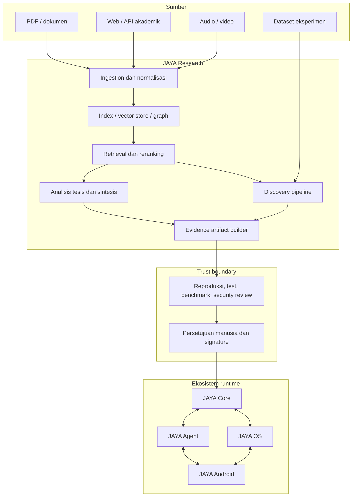

# Arsitektur Ekosistem JAYA

## Konteks sistem

Repositori ini adalah monorepo dengan satu `.git` di root. Modul dipisahkan
berdasarkan tanggung jawab, bukan sebagai repository independen.

```text
jaya-research/
├── docs/             # dokumentasi aktif kanonis
├── JAYA_RESEARCH/    # riset dan knowledge pipeline
├── JAYA_CORE/        # cognitive core
├── JAYA_AGENT/       # orkestrasi agent/tool
├── JAYA_OS/          # runtime dan kebijakan sistem
├── JAYA_ANDROID/     # klien Android
├── mcp-servers/      # integrasi tool/protocol
├── scripts/          # operasi dan validasi lintas modul
└── src/              # integrasi tingkat monorepo
```

## Batas modul

| Modul | Memiliki | Tidak boleh memiliki |
|---|---|---|
| Research | sumber, chunk, citation, graph, hipotesis, eksperimen, paket bukti | mutasi source Core secara langsung |
| Core | intent, reasoning, planning, memory policy, JayaIR | data riset mentah dan UI perangkat |
| Agent | task orchestration, tool routing, permission flow | logika kognitif inti dan driver perangkat |
| OS | sandbox, process/resource policy, hardware abstraction | pengetahuan akademik dan workflow tesis |
| Android | UI mobile, local cache, transport aman | source of truth pengetahuan atau policy pusat |

## Komponen dan hubungan



## Arsitektur JAYA Research

### Interface

- FastAPI di `JAYA_RESEARCH/src/network/research_api.py`.
- React/Vite/Electron di `JAYA_RESEARCH/ui/`.
- Skrip dan launcher lokal untuk operasi pengembang.

### Domain riset

- `src/research/academic/`: literature, novelty, gap, reviewer, editor.
- `src/research/`: agent, RAG client, graph, dan layanan riset lain.
- `src/agentic_research/`: hipotesis, desain/runner eksperimen, analisis,
  safety, writer, dan bridge ekosistem.

### Data

- Dokumen mentah dan state runtime berada di folder yang diabaikan Git.
- Metadata persisten seharusnya memakai store yang mendukung migrasi dan
  transaksi; state proses tidak boleh hanya bergantung pada memori proses.
- Citation menyimpan minimal source ID, lokasi, waktu akses, dan potongan bukti.
- Artefak model/adapter disimpan di registry, bukan dicampur dengan source.

## Kontrak integrasi

Integrasi antar-modul menggunakan kontrak versioned, bukan import internal atau
penulisan file source lintas batas.

Paket promosi minimum:

```text
artifact/
├── manifest.json       # ID, versi, pembuat, waktu, hash, dependency
├── evidence.json       # sumber, metrik, confidence, batasan
├── payload/            # patch/model/rule/data yang akan dievaluasi
├── tests/              # tes reproduksi dan acceptance
├── benchmark.json      # hasil sebelum/sesudah yang nyata
└── signature.json      # approval dan integritas
```

Schema rinci harus ditambahkan sebelum fase promosi ekosistem. Sampai saat itu,
bridge yang menulis file Core langsung dianggap prototipe dan tidak diaktifkan
untuk produksi.

## Trust boundary dan keamanan

- `.env`, key, data pengguna, database, log, model, dan hasil eksperimen tidak
  masuk Git.
- Konten eksternal diperlakukan tidak tepercaya: ukuran, MIME, path, dan isi
  harus divalidasi.
- Tool dan eksperimen berjalan dengan izin minimum, timeout, quota, serta
  sandbox.
- Provider cloud hanya menerima data minimum yang diperlukan; UI harus
  menjelaskan kapan data keluar dari perangkat.
- Setiap artefak lintas modul harus diverifikasi hash/signature dan dapat
  di-rollback.

## Target deployment

Arsitektur menargetkan tiga mode:

1. **Local development:** API dan UI berjalan terpisah di workstation.
2. **Hybrid:** retrieval/data sensitif lokal, inference tertentu melalui
   provider eksternal.
3. **Edge/offline:** model terkuantisasi dan layanan lokal; masih merupakan
   target roadmap, belum baseline produksi.

