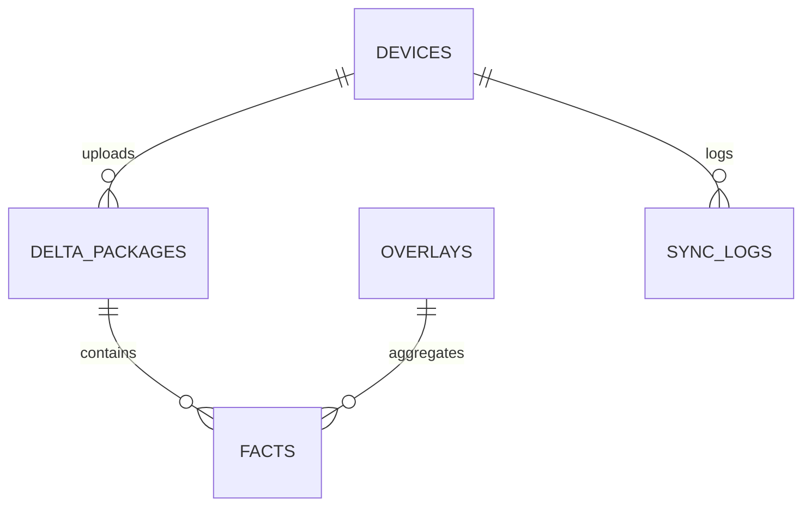

# Pemodelan Basis Data — Central Collector / Aggregator

Versi: 0.1
Tanggal: 2026-05-30

## Tujuan
Rancang skema data untuk menyimpan delta dari perangkat, overlay augmentations, provenance, dan logs audit.

## Entitas Utama
- `devices` — daftar device terdaftar
- `delta_packages` — paket delta yang diupload (kompresi + signature + metadata)
- `overlays` — hasil agregasi/augmentasi yang diterbitkan ke perangkat
- `facts` — fakta terstruktur yang disimpan (opsional, bisa index retrieval)
- `sync_logs` — catatan upload/download dan status

## ERD (mermaid)



## Sample DDL (Postgres)

```sql
CREATE TABLE devices (
  device_id TEXT PRIMARY KEY,
  user_id TEXT,
  device_profile JSONB,
  public_key TEXT,
  created_at TIMESTAMP DEFAULT now()
);

CREATE TABLE delta_packages (
  id UUID PRIMARY KEY DEFAULT gen_random_uuid(),
  device_id TEXT REFERENCES devices(device_id),
  created_at TIMESTAMP DEFAULT now(),
  package_bytes BYTEA,
  signature TEXT,
  compressed_size INT,
  status TEXT,
  metadata JSONB
);

CREATE TABLE overlays (
  overlay_id UUID PRIMARY KEY DEFAULT gen_random_uuid(),
  created_at TIMESTAMP DEFAULT now(),
  schema_version TEXT,
  payload JSONB,
  provenance JSONB
);

CREATE TABLE sync_logs (
  id UUID PRIMARY KEY DEFAULT gen_random_uuid(),
  device_id TEXT,
  op TEXT,
  status TEXT,
  details JSONB,
  created_at TIMESTAMP DEFAULT now()
);
```

## Indexing & Performance
- Index `delta_packages(device_id, created_at)` and `overlays(created_at)`.
- Use partitioning for `delta_packages` by month.

## Provenance & Audit
- Store source device_ids and signatures in `overlays.provenance` and maintain tamper-evident log (append-only) for audit.

## Data Retention
- Keep raw `delta_packages` for a configurable retention (e.g., 90 days) after which compressed summaries may be kept.
