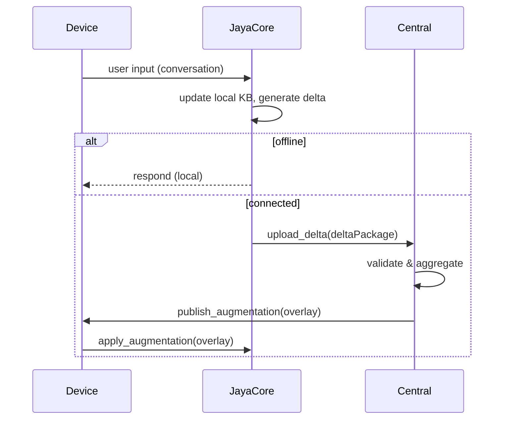

# Pemodelan Alur Kerja & Logika — JAYA_CORE

Versi: 0.1
Tanggal: 2026-05-30

## Tujuan
Menjabarkan alur logika utama: penggunaan offline pada device, capture deltas, sinkronisasi, agregasi pusat, dan augmentasi non-destruktif.

## Aktor
- Device (phone, laptop)
- JAYA_CORE runtime (on-device)
- Central Collector / Aggregator

## High-level Sequence (mermaid)



## Process Steps & Pseudocode

1. Local Turn Handling
- On user turn: run retrieval from local KB, run lightweight model inference, store conversational turn + any learned facts as delta ops.

Pseudocode (delta capture):

```
on_user_turn(turn):
    context = local_kb.retrieve(turn)
    resp = inference.run(context, turn)
    delta = learn.extract_deltas(turn, resp)
    local_store.append(delta)
    return resp
```

2. Delta Packaging & Upload
- Periodic or on-demand, package pending deltas into a compressed bundle signed by device key.

```
package = compress(pending_deltas)
signed = sign(device_key, package)
upload(signed)
```

3. Central Aggregation
- Validate signature, de-duplicate, perform lightweight merge into overlay buckets grouped by topic/namespace. Flag contradictions.

4. Overlay Application on Device
- Device requests augmentations since last_version; apply overlay to retrieval index (do not replace core weights).

## Conflict Handling
- Store conflicting facts with provenance and confidence score.
- Automatic resolution policy: if confidence diff > threshold, accept higher; else mark for human review.

## Edge Cases
- Large offline learning sessions: enforce sampling and summarization before upload to bound bandwidth.
