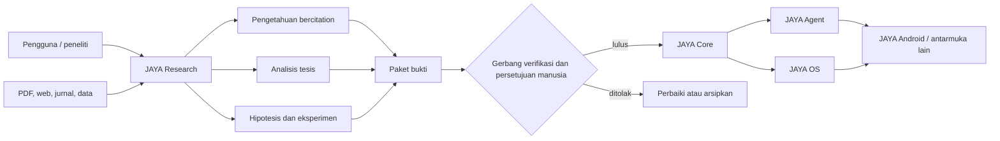

# Pusat Dokumentasi JAYA

**Status:** kanonis  
**Pemilik:** maintainer ekosistem JAYA  
**Terakhir ditinjau:** 2 Agustus 2026

Folder ini adalah satu-satunya sumber kebenaran untuk dokumentasi aktif
ekosistem JAYA. Tujuannya adalah membuat visi, kondisi aktual, keputusan, dan
pekerjaan berikutnya dapat dilacak tanpa membandingkan banyak roadmap yang
saling bertentangan.

## Peta dokumen

| Pertanyaan | Dokumen |
|---|---|
| Apa yang sedang dibangun dan untuk siapa? | [PRODUCT.md](PRODUCT.md) |
| Modul apa yang ada dan di mana batasnya? | [ARCHITECTURE.md](ARCHITECTURE.md) |
| Keputusan arsitektur apa yang sedang berlaku? | [DECISIONS.md](DECISIONS.md) |
| Bagaimana desain internal JAYA Core dan Cognitive Kernel? | [JAYA_CORE_DESIGN.md](JAYA_CORE_DESIGN.md) |
| Bagaimana arsitektur jaringan terdistribusi JAYA Mesh? | [JAYA_MESH_DESIGN.md](JAYA_MESH_DESIGN.md) |
| Bagaimana alur pengguna, data, discovery, dan promosi? | [WORKFLOWS.md](WORKFLOWS.md) |
| Apa yang benar-benar sudah bekerja? | [STATUS.md](STATUS.md) |
| Apa urutan pekerjaan dan gerbang selesainya? | [ROADMAP.md](ROADMAP.md) |
| Apa kontrak penerimaan terukur untuk Phase A? | [ACCEPTANCE_CRITERIA.md](ACCEPTANCE_CRITERIA.md) |
| Kekurangan konkret apa yang sedang diperbaiki? | [REMEDIATION_CHECKLIST.md](REMEDIATION_CHECKLIST.md) |
| Aturan keamanan, bukti, dan persetujuannya apa? | [GOVERNANCE.md](GOVERNANCE.md) |
| Bagaimana menjalankan, menguji, dan mengubah proyek? | [DEVELOPMENT.md](DEVELOPMENT.md) |
| Apa arti istilah yang dipakai? | [GLOSSARY.md](GLOSSARY.md) |
| Apa yang berubah pada dokumentasi/proyek? | [CHANGELOG.md](CHANGELOG.md) |
| Di mana dokumen lama disimpan? | [archive/README.md](archive/README.md) |

## Alur besar yang dibangun

JAYA Research bukan jalur otomatis untuk mengubah otak utama. Ia menghasilkan
pengetahuan dan artefak berbukti. Hanya artefak yang dapat direproduksi, lolos
tes serta benchmark nyata, dan disetujui manusia yang boleh dipromosikan.

## Urutan kebenaran saat terjadi konflik

1. [STATUS.md](STATUS.md) menentukan kondisi implementasi saat ini.
2. [ROADMAP.md](ROADMAP.md) menentukan prioritas dan exit criteria.
3. [WORKFLOWS.md](WORKFLOWS.md) menentukan alur operasional.
4. [ARCHITECTURE.md](ARCHITECTURE.md) menentukan batas komponen.
5. [DECISIONS.md](DECISIONS.md) menentukan keputusan arsitektur yang diterima.
6. Dokumen dalam `archive/` hanya konteks historis.

Jika kode berbeda dari dokumentasi, catat selisihnya di `STATUS.md` sebagai
risiko atau gap. Jangan mengubah status menjadi selesai hanya karena file atau
kelas sudah tersedia.

## Aturan pemeliharaan singkat

- Satu konsep memiliki satu dokumen pemilik; dokumen lain hanya menautkannya.
- Setiap klaim selesai menyertakan bukti tes, benchmark, atau artefak yang dapat
  diulang.
- Setiap perubahan besar memperbarui status, roadmap, dan changelog bersamaan.
- README modul hanya berisi ringkasan serta tautan ke folder ini.
- Jalankan `python scripts/validate_docs.py` sebelum commit.
