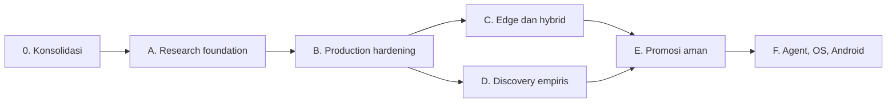

# Roadmap Kanonis JAYA

**Baseline:** 1 Agustus 2026
**Aturan:** fase selesai hanya jika seluruh exit criteria memiliki bukti yang
dapat diaudit

Roadmap ini menggantikan checklist fase yang sebelumnya tersebar di modul.
Definisi penerimaan ilmiah Phase A berada di
[ACCEPTANCE_CRITERIA.md](ACCEPTANCE_CRITERIA.md).

## Ringkasan

| Fase | Status | Tujuan |
|---|---|---|
| 0. Konsolidasi dokumentasi/repository | VERIFIED | Satu Git dan satu sumber dokumentasi |
| A. Research foundation | IN PROGRESS / BLOCKED_EXTERNAL | Fondasi lokal lulus; mutu ilmiah representatif belum terbukti |
| B. Production hardening | IN PROGRESS | Job persisten, aman, terobservasi, dan tahan gagal |
| C. Edge dan hybrid intelligence | PLANNED | Model/router lokal yang memenuhi target perangkat |
| D. Discovery empiris | PROTOTYPE | Hipotesis dan eksperimen nyata yang dapat direproduksi |
| E. Promosi aman ke ekosistem | BLOCKED | Artefak tervalidasi tanpa mutasi source langsung |
| F. Agent, OS, dan Android | PROTOTYPE | Pengalaman lintas perangkat di atas API stabil |

Fase C dan D dapat berjalan paralel setelah kontrak dasar Fase B stabil.

## Fase 0 — Konsolidasi dokumentasi dan repository

- [x] Dokumentasi aktif berada di `docs/`.
- [x] README modul menunjuk ke sumber kanonis.
- [x] Hanya `.git` root yang menjadi repository.
- [x] Validator memeriksa struktur, tautan, dan keterlacakan source/test.

Exit criteria: `python scripts/validate_docs.py` lulus dan `git rev-parse
--show-toplevel` dari `JAYA_RESEARCH` kembali ke root.

## Fase A — Research foundation

Tujuan: ingestion, retrieval, tesis, dan deep research memiliki kontrak yang
jujur, deterministik, serta dapat diuji sebelum evaluasi ilmiah representatif.

### Selesai secara lokal (`PASS_LOCAL`)

- [x] Workspace, validasi input, upload, dan source artifact memiliki batas
  ukuran/path serta failure code yang eksplisit.
- [x] Ingest sumber, retrieval, abstention, citation/provenance, dan pembukaan
  sumber terintegrasi dalam alur API offline.
- [x] Jawaban chat dan recursive research tidak memakai pengetahuan internal
  ketika evidence kosong; hasilnya abstain dan tidak promotable.
- [x] Parsing PDF memakai extractor kanonis dengan kasus normal, korup,
  oversize, OCR-required, dan provider-unavailable yang bertipe.
- [x] Sesi tesis dan artefak deep research memiliki status serta checksum;
  keluaran provider/generatif tetap berlabel tidak terverifikasi.
- [x] Harness RAG lokal memakai
  `JAYA_RESEARCH/evaluation/rag_smoke_v2.json` dengan status `SMOKE_ONLY` dan
  tidak boleh dipakai sebagai bukti mutu produksi.
- [x] Kontrak penerimaan memisahkan `PASS_LOCAL`, `PASS_REPRESENTATIVE`,
  `BLOCKED_EXTERNAL`, dan `FAIL`.
- [x] Suite Research offline lulus: `352 passed, 11 deselected`.
- [x] Acceptance suite Phase A terarah lulus: `194 passed`.
- [x] Suite fokus API Phase A dan E2E lulus: `100 passed`.
- [x] Deep Research UI memakai kontrak service tepat ke
  `/research/recursive`; status `ANSWERED`, abstain, dan conflict ditampilkan
  bersama citation/provenance serta URI dan SHA-256 artefak.
- [x] UI menampilkan hasil sebagai non-promotable dan tidak mengklaim
  `applied`, deployment, atau mutasi JAYA Core.
- [x] Preview/download/export memakai transport terautentikasi; kegagalan index
  tesis ditampilkan apa adanya, sedangkan UI evolution hanya boundary
  `BLOCKED` dan nonaktif secara default.
- [x] Auth UI menyimpan API key hanya di memori runtime dan memverifikasinya
  melalui operasi baca; transport mempertahankan `ApiError` terstruktur,
  `Idempotency-Key` untuk autonomous research, dan kontrak CORS.
- [x] Router internal tervalidasi menggantikan `react-router` yang terkena
  advisory; UI memakai Vite 8, lazy chunks, dan memiliki `npm audit` 0
  vulnerability.
- [x] Suite kontrak UI lulus `12 passed`; lint dan production build lulus.

### Belum selesai secara ilmiah (`BLOCKED_EXTERNAL`)

- [ ] Sediakan dataset RAG representatif yang versioned, legal, memiliki
  sampling frame, dan disetujui penanggung jawab ilmiah.
- [ ] Buktikan target QA minimal 85% pada dataset representatif tersebut dengan
  run yang terikat commit, konfigurasi, dan environment.
- [ ] Lakukan evaluasi novelty/gap pada corpus berlabel bersama reviewer domain.
- [ ] Lakukan evaluasi PDF pada corpus gold, termasuk OCR, tabel, gambar, bahasa,
  dan dokumen rusak dunia nyata.
- [ ] Jalankan studi empiris dengan data/compute nyata, persetujuan etik dan
  legal, serta reproduksi independen.
- [ ] Audit entailment citation dan kualitas sintesis oleh manusia.
- [ ] Jalankan gate yang sama pada CI bersih dan simpan artefak hasilnya.
- [ ] Jalankan browser E2E terhadap API ter-deploy dan provider live, lalu
  verifikasi auth, CORS, idempotency, navigasi, failure path, dan artefak pada
  target deployment.

Dataset lama `rag_representative_v1.json` telah dihapus karena tidak memenuhi
syarat representativeness. Seluruh metrik yang pernah berasal dari dataset itu
telah ditarik dan tidak boleh digunakan untuk menutup Phase A.

Exit criteria Phase A saat ini: kontrak software berstatus `PASS_LOCAL`, tetapi
Phase A keseluruhan tetap `IN PROGRESS / BLOCKED_EXTERNAL`. Fase ini baru boleh
ditutup setelah seluruh gate representatif dan manusia pada
[ACCEPTANCE_CRITERIA.md](ACCEPTANCE_CRITERIA.md) memiliki bukti sah.

## Fase B — Production hardening

Tujuan: pekerjaan panjang bertahan terhadap restart dan dapat dioperasikan aman.

- [x] Persistensikan sesi tesis dengan repository SQLite dan recovery state.
- [x] Sediakan state machine job, progress, cancel, resume, retry, dan
  idempotency pada kontrak lokal.
- [x] Terapkan auth/authz, rate limit, quota, validasi upload, dan CORS
  allowlist pada kontrak lokal.
- [ ] Pisahkan seluruh long-running job dari proses API ke queue/worker produksi.
- [ ] Lengkapi structured log, metric, trace, dan correlation ID lintas proses.
- [ ] Uji backup/restore, crash recovery, timeout provider, dan partial failure
  pada deployment bersih.
- [ ] Buktikan clean install dan restart pada environment produksi target.

Exit criteria: recovery dan operational drill lulus, observability tersedia,
threat review ditutup, dan tidak ada state kritis yang hanya hidup di memori.

## Fase C — Edge dan hybrid intelligence

- [ ] Tetapkan dataset student yang legal, bersih, dan versioned.
- [ ] Jalankan training/LoRA nyata; pisahkan tegas dari simulasi.
- [ ] Konversi dan kuantisasi GGUF q4 dengan target ukuran di bawah 300 MB.
- [ ] Ukur kualitas, latency, RAM, energi, dan thermal pada perangkat target.
- [ ] Buat router local/cloud dengan privacy policy dan fallback eksplisit.
- [ ] Tambahkan model registry, signature, kompatibilitas, dan rollback.

Exit criteria: model target memenuhi ambang ukuran, kualitas, dan resource pada
perangkat nyata.

## Fase D — Discovery empiris

- [ ] Gunakan hipotesis grounded dengan evidence ID dan falsifiability.
- [ ] Simpan dataset, seed, config, environment, metode, dan stop rule.
- [ ] Hitung uncertainty, effect size, power, dan koreksi multiple testing.
- [ ] Wajibkan reproduksi independen sebelum status kandidat temuan.
- [ ] Hubungkan scientific writer hanya ke evidence store tervalidasi.
- [ ] Terapkan etik, lisensi, privasi, dan resource gate.

Exit criteria: minimal satu studi nyata dapat direproduksi dari nol tanpa klaim
empiris yang berasal dari simulasi.

## Fase E — Promosi aman ke ekosistem

- [x] Jalur Research menghasilkan candidate/evidence artifact dan tidak menulis
  source Core secara langsung pada kontrak lokal.
- [ ] Verifikasi ulang validator, signature, approval, canary, replay
  protection, audit, dan rollback sebagai satu gate integrasi.
- [ ] Jalankan benchmark nyata pada candidate environment yang bersih.
- [ ] Lengkapi security/license review serta persetujuan manusia.
- [ ] Buktikan canary, revocation, dan rollback pada deployment target.

Exit criteria: artefak gagal tidak dapat dipasang; artefak lulus dapat dipasang
dan di-rollback tanpa memalsukan bukti atau mengubah source tree.

## Fase F — Agent, OS, dan Android

- [ ] Stabilkan kontrak Core → Agent → OS pada deployment target.
- [ ] Selesaikan pemisahan ownership `JAYA_OS` dari kernel legacy di Core.
- [ ] Terapkan consent, permission, sandbox, dan audit pada setiap tool/action.
- [ ] Verifikasi APK, model runtime, cache offline, dan sync pada perangkat nyata.
- [ ] Tambahkan compatibility matrix dan E2E lintas perangkat.

Exit criteria: skenario riset-ke-tindakan berjalan end-to-end pada perangkat
target dengan permission, audit, degraded mode, dan rollback yang terbukti.

## Prioritas berikutnya

1. Bentuk dan setujui dataset RAG representatif; jangan menaikkan status dari
   fixture `SMOKE_ONLY`.
2. Jalankan audit citation/sintesis dan review novelty/gap bersama manusia.
3. Siapkan corpus PDF gold serta provider OCR/table/figure yang nyata.
4. Jalankan studi empiris dan reproduksi independen dengan data yang sah.
5. Setelah gate ilmiah tersedia, lanjutkan hardening worker/deployment Phase B.
