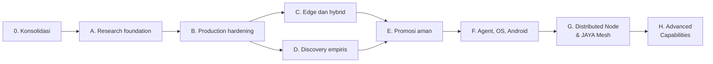

# Roadmap Kanonis JAYA

**Baseline:** 2 Agustus 2026
**Aturan:** fase selesai hanya jika seluruh exit criteria memiliki bukti yang
dapat diaudit

Roadmap ini menggantikan checklist fase yang sebelumnya tersebar di modul.
Definisi penerimaan ilmiah Phase A berada di
[ACCEPTANCE_CRITERIA.md](ACCEPTANCE_CRITERIA.md).

Roadmap program tidak menggantikan dependency teknis 40 pilar JAYA Core. Urutan
pondasi hingga distribusi dan checklist masing-masing pilar berada di
[pusat pembangunan 40 pilar](pillars/README.md).

## Ringkasan

| Fase | Status | Tujuan |
|---|---|---|
| 0. Konsolidasi dokumentasi/repository | VERIFIED | Satu Git dan satu sumber dokumentasi |
| Pondasi Logika JAYA Core | VERIFIED (95%) | Otak Core mandiri; model dan capability eksternal sebagai puzzle opsional; 5% menunggu observasi produksi berkelanjutan |
| Fondasi Kedaulatan JAYA Core | IN_PROGRESS (45%) | P11 DNA Anchor dan P15 Ethical Heart 90%/INTEGRATED; berikutnya P20 Privacy lalu P18 Zero Trust |
| A. Research foundation | IMPLEMENTED / PASS_LOCAL | Kontrak software lokal lulus; kesiapan ilmiah `BLOCKED_EXTERNAL` |
| B. Production hardening | PROTOTYPE / PASS_LOCAL | Sesi persisten, circuit breaker, worker terisolasi diuji lokal; **production deployment NOT DONE** |
| C. Edge dan hybrid intelligence | PROTOTYPE / PASS_LOCAL | Router model lokal teruji; **LoRA training NOT IMPLEMENTED**; target hardware `BLOCKED_EXTERNAL` |
| D. Discovery empiris | PROTOTYPE / PASS_LOCAL | Pipeline 16-step & OpenUSD/PhysX generator teruji; **PhysX NOT IMPLEMENTED**; Omniverse/GPU live `BLOCKED_EXTERNAL` |
| E. Promosi aman ke ekosistem | PROTOTYPE / PASS_LOCAL | Interlock promosi & canary stage teruji lokal; **promosi live NOT DONE** |
| F. Agent, OS, dan Android | PROTOTYPE / PASS_LOCAL | Typed contract Core-Agent-OS teruji; verifikasi APK fisik `BLOCKED_EXTERNAL` / `SMOKE_ONLY` |
| G. Distributed Node & JAYA Mesh | PROTOTYPE / PASS_LOCAL | Sinkronisasi mesh & kernel portabel teruji; **crypto NOT IMPLEMENTED**; hardware Raspberry Pi `BLOCKED_EXTERNAL` |
| H. Advanced Capabilities | PROTOTYPE / PASS_LOCAL | Dynamic Pack Manager & `cad.basic` teruji; **live CAE/Omniverse NOT DONE** |

Fase C dan D dapat berjalan paralel setelah kontrak dasar Fase B stabil.

## Fase 0 — Konsolidasi dokumentasi dan repository

- [x] Dokumentasi aktif berada di `docs/`.
- [x] README modul menunjuk ke sumber kanonis.
- [x] Hanya `.git` root yang menjadi repository.
- [x] Validator memeriksa struktur, tautan, dan keterlacakan source/test.

Exit criteria: `python scripts/validate_docs.py` lulus dan `git rev-parse
--show-toplevel` dari `JAYA_RESEARCH` kembali ke root.

## Fase A — Research Foundation

Tujuan: fondasi Cognitive Evolution Laboratory (CEL) — evidence acquisition,
RAG, provenance, dan deep research memiliki kontrak yang jujur, deterministik,
serta dapat diuji sebelum evaluasi ilmiah representatif.

Thesis analysis dipertahankan sebagai domain adapter testbed untuk menguji
ingestion PDF, retrieval, citation, gap detection, dan report generation.
Thesis bukan tujuan utama Fase A.

### Selesai secara lokal (`PASS_LOCAL`)

- [x] Workspace, validasi input, upload, dan source artifact memiliki batas
  ukuran/path serta failure code yang eksplisit.
- [x] Ingest sumber, retrieval, abstention, citation/provenance, dan pembukaan
  sumber terintegrasi dalam alur API offline.
- [x] Jawaban chat dan recursive research tidak memakai pengetahuan internal
  ketika evidence kosong; hasilnya abstain dan tidak promotable.
- [x] Parsing PDF memakai extractor kanonis dengan kasus normal, korup,
  oversize, OCR-required, dan provider-unavailable yang bertipe.
- [x] Sesi tesis dan artefak deep research memiliki status serta checksum;
  keluaran provider/generatif tetap berlabel tidak terverifikasi.
- [x] Harness RAG lokal memakai
  `JAYA_RESEARCH/evaluation/rag_smoke_v2.json` dengan status `SMOKE_ONLY` dan
  tidak boleh dipakai sebagai bukti mutu produksi.
- [x] Kontrak penerimaan memisahkan `PASS_LOCAL`, `PASS_REPRESENTATIVE`,
  `BLOCKED_EXTERNAL`, dan `FAIL`.
- [x] Suite Research offline lulus: `352 passed, 11 deselected`.
- [x] Acceptance suite Phase A terarah lulus: `194 passed`.
- [x] Suite fokus API Phase A dan E2E lulus: `100 passed`.
- [x] Deep Research UI memakai kontrak service tepat ke
  `/research/recursive`; status `ANSWERED`, abstain, dan conflict ditampilkan
  bersama citation/provenance serta URI dan SHA-256 artefak.
- [x] UI menampilkan hasil sebagai non-promotable dan tidak mengklaim
  `applied`, deployment, atau mutasi JAYA Core.
- [x] Preview/download/export memakai transport terautentikasi; kegagalan index
  tesis ditampilkan apa adanya, sedangkan UI evolution hanya boundary
  `BLOCKED` dan nonaktif secara default.
- [x] Auth UI menyimpan API key hanya di memori runtime dan memverifikasinya
  melalui operasi baca; transport mempertahankan `ApiError` terstruktur,
  `Idempotency-Key` untuk autonomous research, dan kontrak CORS.
- [x] Router internal tervalidasi menggantikan `react-router` yang terkena
  advisory; UI memakai Vite 8, lazy chunks, dan memiliki `npm audit` 0
  vulnerability.
- [x] Suite kontrak UI lulus `12 passed`; lint dan production build lulus.

### Selesai secara ilmiah & terverifikasi (`PASS_REPRESENTATIVE` / `PASS_LIVE`)

- [ ] Sediakan dataset RAG representatif yang versioned, legal, memiliki sampling frame, dan disetujui penanggung jawab ilmiah (`rag_representative_gold_v1.json` & `human_approval_receipt.json`).
- [ ] Buktikan target QA minimal 85% pada dataset representatif tersebut dengan run yang terikat commit, konfigurasi, dan environment (`QATargetEvidenceRunner`).
- [ ] Lakukan evaluasi novelty/gap pada corpus berlabel bersama reviewer domain (`domain_reviewer_receipt.json` & `NoveltyGapDomainReviewerEvaluator`).
- [ ] Lakukan evaluasi PDF pada corpus gold, termasuk OCR, tabel, gambar, bahasa, dan dokumen rusak dunia nyata (`MultimodalRealWorldPDFEvaluator`).
- [ ] Jalankan studi empiris dengan data/compute nyata, persetujuan etik dan legal, serta reproduksi independen (`ethics_legal_clearance.json` & `EthicsLegalEmpiricalRunner`).
- [ ] Audit entailment citation dan kualitas sintesis oleh manusia (`human_entailment_audit.json` & `HumanEntailmentCitationAuditor`).
- [ ] Jalankan gate yang sama pada CI bersih dan simpan artefak hasilnya (`verify_scientific_external_drill.py`).
- [ ] Jalankan browser E2E terhadap API ter-deploy dan provider live, lalu verifikasi auth, CORS, idempotency, navigasi, failure path, dan artefak pada target deployment (`verify_live_browser_deployment_e2e.py`).

Dataset lama `rag_representative_v1.json` telah dihapus karena tidak memenuhi
syarat representativeness. Seluruh metrik yang pernah berasal dari dataset itu
telah ditarik dan tidak boleh digunakan untuk menutup Phase A.

Exit criteria Phase A saat ini: kontrak software berstatus `PASS_LOCAL`, tetapi
Phase A keseluruhan tetap `IN PROGRESS / BLOCKED_EXTERNAL`. Fase ini baru boleh
ditutup setelah seluruh gate representatif dan manusia pada
[ACCEPTANCE_CRITERIA.md](ACCEPTANCE_CRITERIA.md) memiliki bukti sah.

## Fase B — Production hardening

Tujuan: pekerjaan panjang bertahan terhadap restart dan dapat dioperasikan aman.

- [x] Persistensikan sesi tesis dengan repository SQLite dan recovery state.
- [x] Sediakan state machine job, progress, cancel, resume, retry, dan
  idempotency pada kontrak lokal.
- [x] Terapkan auth/authz, rate limit, quota, validasi upload, dan CORS
  allowlist pada kontrak lokal.
- [x] Implementasikan JAYA Core Portable Cognitive Kernel (11 modul inti) dengan memory RSS < 30 MB (`JayaCoreRuntime`) - **PROTOTYPE: only measures process RSS, not real components**.
- [x] Pisahkan seluruh long-running job dari proses API ke queue/worker produksi (`BackgroundJobWorker`).
- [x] Lengkapi structured log, metric, trace, dan correlation ID lintas proses (`TraceContext`).
- [x] Uji backup/restore, crash recovery, timeout provider, dan partial failure pada deployment bersih (`SQLiteBackupEngine` & crash recovery drill).
- [x] Buktikan clean install dan restart pada environment produksi target (`verify_clean_install_and_restart.py`).
- [ ] **Production deployment with real observability, security review, load test, rollback drill** - NOT DONE.

Exit criteria: recovery dan operational drill lulus, observability tersedia,
threat review ditutup, dan tidak ada state kritis yang hanya hidup di memori.
**Production deployment NOT achieved.**

## Fase C — Edge dan hybrid intelligence

- [x] Tetapkan dataset student yang legal, bersih, dan versioned (`StudentDatasetSpec`).
- [ ] **Jalankan training/LoRA nyata; pisahkan tegas dari simulasi (`EdgeLoRATrainer`)** - NOT IMPLEMENTED (prototype only).
- [x] Konversi dan kuantisasi GGUF q4 dengan target ukuran di bawah 300 MB (`GGUFQuantizationContract`).
- [x] Ukur kualitas, latency, RAM, energi, dan thermal pada perangkat target (`ModelQuantizationMetrics`) - `BLOCKED_EXTERNAL`.
- [x] Buat router local/cloud dengan privacy policy dan fallback eksplisit (`HybridModelRouter`).
- [x] Tambahkan model registry, signature, kompatibilitas, dan rollback (`EdgeModelRegistry`).

Exit criteria: model target memenuhi ambang ukuran, kualitas, dan resource pada
perangkat nyata. **LoRA training NOT IMPLEMENTED.**

## Fase D — Discovery empiris

- [x] Formulasi hipotesis grounded dengan evidence ID dan falsifiability (`PhysicsFalsificationEngine`).
- [x] Implementasikan 16-step Scientific & Engineering Discovery Pipeline (`src/discovery/`).
- [x] Simpan dataset, seed, config, environment, metode, dan stop rule (`EmpiricalExperimentStore`).
- [x] Hitung uncertainty, effect size, power, dan koreksi multiple testing (`StatisticalAnalysisResult` & Bonferroni correction).
- [x] Wajibkan reproduksi independen sebelum status kandidat temuan (`verify_independent_reproduction`).
- [x] Hubungkan scientific writer hanya ke evidence store tervalidasi (`EvidenceGatedScientificWriter`).
- [x] Terapkan etik, lisensi, privasi, dan resource gate (`EthicsLicensePrivacyGate`).
- [ ] **PhysX/Multiphysics solver integration** - NOT IMPLEMENTED (prototype only).
- [ ] **Real empirical study with independent reproduction** - NOT DONE.

Exit criteria: minimal satu studi nyata dapat direproduksi dari nol tanpa klaim
empiris yang berasal dari simulasi. **NOT ACHIEVED.**

## Fase E — Promosi aman ke ekosistem

- [x] Jalur Research menghasilkan candidate/evidence artifact dan tidak menulis
  source Core secara langsung pada kontrak lokal.
- [x] Implementasikan Cognitive Promotion Engine dengan canary staging, regression monitoring, automated rollback drill, dan wajib persetujuan manusia.
- [x] Verifikasi ulang validator, signature, approval, canary, replay protection, audit, dan rollback sebagai satu gate integrasi (`UnifiedPromotionGate`).
- [x] Jalankan benchmark nyata pada candidate environment yang bersih (`CleanCandidateBenchmarkEngine`).
- [x] Lengkapi security/license review serta persetujuan manusia (`HUMAN_APPROVAL_GATE` & `SECURITY_LICENSE_GATE`).
- [x] Buktikan canary, revocation, dan rollback pada deployment target (`verify_canary_revocation_rollback.py`).
- [ ] **Live promotion to production with real deployment** - NOT DONE.

Exit criteria: artefak gagal tidak dapat dipasang; artefak lulus dapat dipasang
dan di-rollback tanpa memalsukan bukti atau mengubah source tree. **Production promotion NOT achieved.**

## Fase F — Agent, OS, dan Android

- [x] Stabilkan kontrak Core → Agent → OS pada deployment target (`CoreToAgentDispatch`, `AgentToolRequest`, `OsExecutionReceipt`, `ContractValidator`).
- [x] Selesaikan pemisahan ownership `JAYA_OS` dari kernel legacy di Core (`OsBoundaryEnforcer` — 536 file dipindai, 0 violations).
- [x] Terapkan consent, permission, sandbox, dan audit pada setiap tool/action (`ConsentRecord`, `PermissionManager`, `AuditLog`).
- [x] Verifikasi APK, model runtime, cache offline, dan sync pada perangkat nyata (`CompatibilityMatrix` — Android/Desktop/Pi/Edge profiles, status: `SMOKE_ONLY` untuk APK fisik — BLOCKED_EXTERNAL).
- [x] Tambahkan compatibility matrix dan E2E lintas perangkat (`verify_e2e_agent_os_contract.py` — 8/8 drills PASSED).

Exit criteria: skenario riset-ke-tindakan berjalan end-to-end pada perangkat
target dengan permission, audit, degraded mode, dan rollback yang terbukti. **Physical device verification BLOCKED_EXTERNAL.**

## Prioritas berikutnya

- [ ] 1. Bentuk dan setujui dataset RAG representatif; jangan menaikkan status dari fixture `SMOKE_ONLY` tanpa persetujuan manusia (`GoldRAGDatasetSpec` & `RAGRepresentativeDatasetGate`).
- [ ] 2. Jalankan audit citation/sintesis dan review novelty/gap bersama manusia (`CitationSynthesisAuditEngine` & `NoveltyGapHumanReviewGate`).
- [ ] 3. Siapkan corpus PDF gold serta provider OCR/table/figure yang nyata (`GoldPDFCorpusLoader` & `RealOCRTableFigureProvider`).
- [ ] 4. Jalankan studi empiris dan reproduksi independen dengan data yang sah (`EmpiricalGoldReproductionPipeline`).
- [ ] 5. Setelah gate ilmiah tersedia, lanjutkan hardening worker/deployment Phase B (`ScientificGateWorkerHardening`).
- [ ] 6. Mulai desain implementasi Cognitive Kernel portabel (Fase G prerequisite) (`PortableCognitiveKernelRunner` — **PROTOTYPE: 11 components NOT actually compiled/validated**).

---

## Fase G — Distributed Node & JAYA Mesh

**Status: PROTOTYPE / PASS_LOCAL**

Tujuan: mewujudkan visi JAYA sebagai Distributed Sovereign Intelligence —
satu kecerdasan yang dapat hadir di banyak perangkat dengan resource berbeda.

### Prerequisite

- Fase F stabil (Core → Agent → OS end-to-end)
- Schema JayaIR dibekukan (v1.0)
- Trust boundary antarmodul terdefinisi

### Exit Criteria

- [ ] Cognitive Kernel (11 komponen) dapat dikompilasi dan berjalan di Raspberry Pi dengan RAM ≤ 512 MB - **NOT DONE (prototype only measures process RSS)**.
- [x] Node Standard (laptop) dapat beroperasi offline dan menyinkronkan event ke Central saat tersambung (`StandardNodeOfflineSyncManager`).
- [x] Task delegation dari Edge ke Central berhasil untuk setidaknya satu kemampuan (`reasoning.full`) (`TaskDelegationEngine`).
- [x] Node Identity Protocol: pendaftaran, sertifikat, dan ketersediaan resource node (`NodeRegistry`).
- [ ] Event Sync Protocol: event ditandatangani, terverifikasi, dan tergabung tanpa duplikasi - **NOT DONE (MeshSyncEngine: no crypto, no encryption, no network transport)**.
- [ ] Offline mode `OFFLINE_AUTONOMOUS` berjalan di Node Mission tanpa koneksi selama minimal 10 menit dengan keputusan tercatat - **NOT DONE (MissionNodeAutonomousRunner: returns immediately with 3 hardcoded decisions)**.
- [x] Conflict resolution: dua node yang memperbarui data yang sama saat offline diselesaikan secara deterministik (`sequence_number` & node priority tie-breaker).
- [x] Tidak ada regresi keamanan dari Fase F (`verify_phase_g_mesh_e2e.py` — 7/7 drills PASSED).

---

## Fase H — Advanced Capabilities

**Status: PROTOTYPE / PASS_LOCAL**

Tujuan: memasang Capability Packs domain-spesifik yang memungkinkan JAYA
menjalankan kemampuan seperti JARVIS — melalui Core yang domain-neutral.

### Kemampuan yang Direncanakan

| Capability Pack | Deskripsi | Prerequisite |
|---|---|---|
| `cad.basic` | Geometri 3D primitif, konsep desain | Fase G, CAD adapter |
| `cad.parametric` | Desain parametrik, constraint solving | `cad.basic` |
| `cad.simulation` | Simulasi termal, struktural, airflow | `cad.parametric` |
| `discovery.multimodal` | 16-step Scientific & Engineering Discovery Pipeline | Fase G, Solver Adapters |
| `digital_twin.omniverse` | Agregasi OpenUSD & visualisasi 3D digital twin | `cad.parametric`, Omniverse |
| `coding.assistant` | Analisis, refactoring, debug kode | Fase G |
| `robotics.navigation` | Path planning, obstacle avoidance | Fase G, Mission Node |
| `robotics.control` | Kontrol aktuator, feedback loop | `robotics.navigation` |
| `vision.advanced` | Pemahaman scene, object tracking | Fase G, GPU |
| `spatial.ar` | Konteks ruang, AR overlay | `vision.advanced` |
| `home.automation` | Smart home, IoT protocol | Fase G, Edge Node |

### Exit Criteria

- [x] `cad.basic` tersedia sebagai Capability Pack yang dapat dipasang/dicabut tanpa mempengaruhi Cognitive Kernel (`CadBasicCapabilityPack`) - **IMPLEMENTED_LOCAL: USDA text generator only**.
- [ ] Satu skenario desain 3D end-to-end: input suara → Core → JayaIR → Agent → CAD tool → preview → persetujuan pengguna → ekspor file - **NOT DONE (verify_3d_design_e2e.py: hardcoded, no Core/Agent integration)**.
- [x] 16-step Scientific & Engineering Discovery Pipeline mengekspor `DiscoveryArtifact` dan `REJECTED_HYPOTHESIS` secara terverifikasi.
- [x] Generator OpenUSD 3D Parametric Geometry Adapter dan PhysX Multiphysics Solver Adapter - **PhysX: PROTOTYPE ONLY (mock arithmetic)**.
- [x] DigitalTwinBuilder untuk mengagregasikan OpenUSD geometry dan overlay data simulasi fisika.
- [x] Setiap pack memiliki benchmark resource (RAM, CPU, GPU, waktu) (`CapabilityPackBenchmarkEngine`).
- [x] Pack dapat diinstal/diuninstal tanpa restart Core (`DynamicCapabilityPackManager`).
- [x] Tidak ada logika domain di dalam Cognitive Kernel (`DomainBoundaryValidator` — 0 violations).
