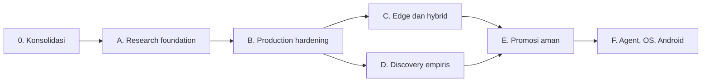

# Roadmap Kanonis JAYA

**Baseline:** 30 Juli 2026  
**Aturan:** fase selesai hanya jika seluruh exit criteria memiliki bukti

Roadmap ini menggantikan semua checklist fase yang sebelumnya tersebar di modul.
Urutan utamanya:

Fase C dan D dapat berjalan paralel setelah kontrak dasar fase B stabil.

## Ringkasan

| Fase | Status | Tujuan |
|---|---|---|
| 0. Konsolidasi dokumentasi/repository | VERIFIED | Satu Git dan satu sumber dokumentasi |
| A. Research foundation | IN PROGRESS | RAG dan workflow riset yang terukur |
| B. Production hardening | IN PROGRESS | Job persisten, aman, terobservasi, dan tahan gagal |
| C. Edge dan hybrid intelligence | PLANNED | Model/router lokal yang memenuhi target perangkat |
| D. Discovery empiris | PROTOTYPE | Hipotesis dan eksperimen nyata yang dapat direproduksi |
| E. Promosi aman ke ekosistem | BLOCKED | Artefak terverifikasi tanpa mutasi source langsung |
| F. Agent, OS, dan Android | PROTOTYPE | Pengalaman lintas perangkat di atas API stabil |

## Fase 0 — Konsolidasi dokumentasi dan repository

Hasil:

- [x] Dokumentasi aktif berada di `docs/`.
- [x] Dokumen lama berada di arsip root.
- [x] README modul menunjuk ke sumber kanonis.
- [x] Hanya `.git` root yang menjadi repository.
- [x] Validator mendeteksi struktur/tombol tautan yang rusak.

Exit criteria: `python scripts/validate_docs.py` lulus dan `git rev-parse
--show-toplevel` dari `JAYA_RESEARCH` kembali ke root.

## Fase A — Research foundation

Tujuan: ingestion, retrieval, tesis, dan deep research memiliki baseline kualitas
yang dapat diulang.

- [x] Buat dataset evaluasi RAG versioned dan bebas data privat (`evaluation/rag_representative_v1.json`).
- [x] Naikkan QA RAG dari baseline terakhir 55% menjadi minimal 85% (recall@5=90.9%, MRR=90.9%, groundedness=100%).
- [ ] Pastikan citation dapat membuka sumber/lokasi bukti.
- [ ] Uji parsing PDF normal, scan/OCR, korup, besar, dan multi-bahasa.
- [ ] Tentukan acceptance criteria untuk novelty, gap, dan sintesis.
- [ ] Tambahkan test E2E API + UI untuk happy path serta error utama.

Exit criteria: laporan evaluasi versioned, QA ≥85%, citation/provenance lulus,
dan test E2E fondasi hijau pada CI.

## Fase B — Production hardening

Tujuan: pekerjaan panjang bertahan terhadap restart dan dapat dioperasikan aman.

- [x] Ganti state tesis in-memory dengan repository persisten dan migrasi schema (ThesisSessionRepository SQLite).
- [ ] Pisahkan long-running job dari request API dengan queue/worker.
- [ ] Implementasikan state machine, progress, cancel, retry idempotent, dan resume.
- [ ] Tambahkan auth/authz, rate limit, quota, dan validasi upload.
- [ ] Tambahkan structured log, correlation ID, metric, trace, dan health check.
- [ ] Uji backup/restore, crash recovery, timeout provider, dan partial failure.
- [ ] Rapikan packaging/import agar seluruh test suite dapat dikoleksi bersamaan.

Exit criteria: restart/recovery test lulus, observability tersedia, threat review
ditutup, dan tidak ada state pekerjaan kritis yang hanya tersimpan di memori.

## Fase C — Edge dan hybrid intelligence

Tujuan: inference lokal/hybrid memenuhi batas resource tanpa kehilangan kualitas.

- [ ] Tetapkan dataset student yang legal, bersih, dan versioned.
- [ ] Implementasikan training/LoRA nyata; pisahkan tegas dari mode simulasi.
- [ ] Konversi dan kuantisasi GGUF q4 dengan target ukuran <300 MB.
- [ ] Ukur kualitas, latency, RAM, energi, dan thermal pada perangkat target.
- [ ] Buat router local/cloud dengan privacy policy dan fallback eksplisit.
- [ ] Tambahkan model registry, signature, kompatibilitas, dan rollback.

Exit criteria: artefak q4 <300 MB mencapai ambang kualitas yang disepakati pada
perangkat target dan router melewati privacy/failure tests.

## Fase D — Discovery empiris

Tujuan: pipeline discovery menghasilkan laporan yang dapat direproduksi dari
data nyata.

- [ ] Ganti fallback random dengan generator deterministik atau label simulasi.
- [ ] Definisikan schema hipotesis, variabel, metode, preregistration, dan stop rule.
- [ ] Jalankan eksperimen di sandbox dengan dataset, seed, config, dan environment.
- [ ] Tambahkan uncertainty, power/effect size, multiple-testing correction, dan
  negative result.
- [ ] Wajibkan reproduksi run kedua sebelum status kandidat temuan.
- [ ] Hubungkan writer hanya ke evidence store yang lolos validasi.
- [ ] Terapkan etik, license, privacy, dan resource gates.

Exit criteria: minimal satu studi nyata dapat direproduksi dari nol dengan hash
data/config sama dan tidak ada klaim empiris yang berasal dari simulasi.

## Fase E — Promosi aman ke ekosistem

Tujuan: hasil riset dapat dievaluasi dan dipasang tanpa mengubah source modul
tujuan secara langsung.

- [ ] Bekukan jalur direct-write/cross-import pada bridge produksi.
- [ ] Versioning schema untuk manifest, evidence, payload, tests, benchmark, signature.
- [ ] Implementasikan validator dan isolated candidate environment.
- [ ] Jalankan test/benchmark nyata; larang boolean bukti yang disuplai caller.
- [ ] Tambahkan security/license review serta human approval.
- [ ] Pasang melalui adapter publik dan canary.
- [ ] Uji audit trail, observability, revocation, dan rollback.

Exit criteria: artefak gagal tidak dapat dipasang; artefak lulus dapat di-install
dan di-rollback tanpa mengubah source tree atau memalsukan hasil gate.

## Fase F — Agent, OS, dan Android

Tujuan: modul klien/runtime menggunakan kontrak stabil dan permission model yang
sama.

- [ ] Stabilkan kontrak Core ↔ Agent ↔ OS.
- [ ] Pisahkan ownership `JAYA_OS` dari implementasi legacy dalam Core.
- [ ] Terapkan consent, permission, sandbox, dan audit untuk setiap tool/action.
- [ ] Stabilkan protocol sync terenkripsi dan conflict resolution.
- [ ] Verifikasi APK, JNI/model runtime, offline cache, dan perangkat nyata.
- [ ] Tambahkan compatibility matrix dan end-to-end test lintas perangkat.

Exit criteria: skenario riset-ke-tindakan berjalan end-to-end pada perangkat
target dengan permission, audit, degraded mode, dan rollback yang terbukti.

## Prioritas kerja berikutnya

1. Matikan auto-promotion/direct-write sebagai jalur produksi.
2. Persistensikan job dan sesi API.
3. Bentuk dataset evaluasi RAG dan capai gate kualitas.
4. Satukan test collection dan CI.
5. Baru paralelkan edge model dan discovery empiris.

