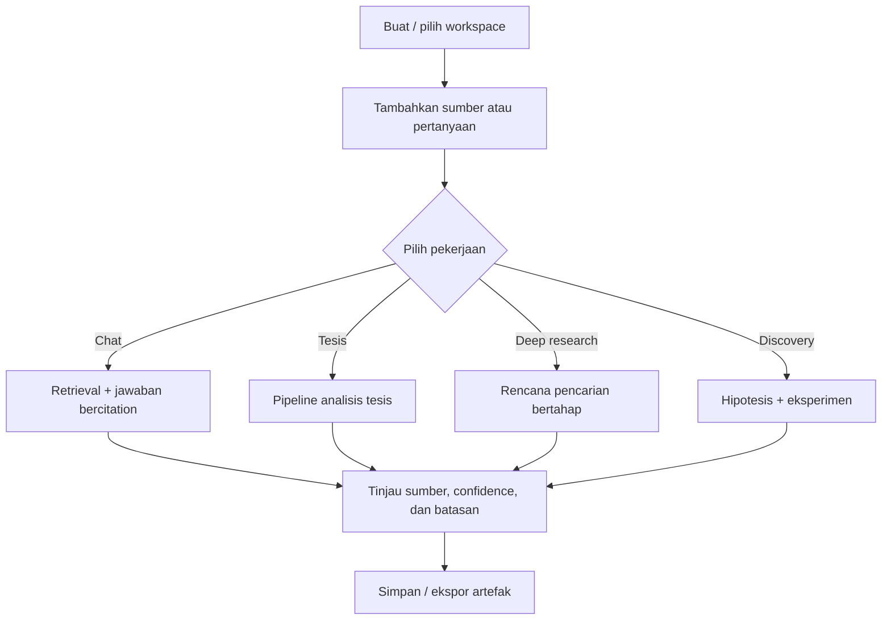
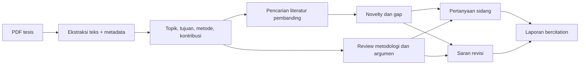
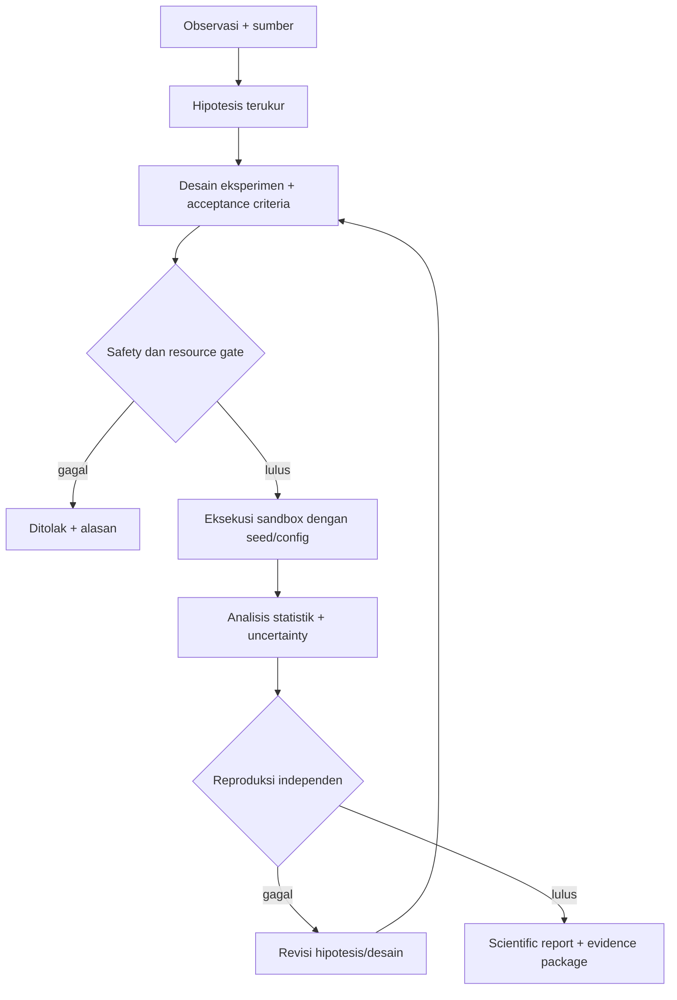

# Alur Sistem JAYA

Dokumen ini mendefinisikan alur operasional. Kondisi implementasi aktual tetap
merujuk ke [STATUS.md](STATUS.md), sedangkan urutan pengerjaan merujuk ke
[ROADMAP.md](ROADMAP.md).

## 1. Alur pengguna utama



Setiap pekerjaan memiliki `job_id`, state, progress, timestamp, error yang dapat
ditindaklanjuti, dan tautan ke artefak. Target state machine:

```text
QUEUED -> RUNNING -> WAITING_REVIEW -> SUCCEEDED
                    \-> FAILED
QUEUED/RUNNING/WAITING_REVIEW -> CANCELED
FAILED -> RETRYING -> RUNNING
```

Pekerjaan panjang harus persisten dan idempotent. Restart API tidak boleh
menghapus sesi atau membuat artefak ganda.

## 2. Ingestion dan RAG

1. Pengguna mengunggah atau menautkan sumber.
2. Sistem memvalidasi izin, ukuran, tipe, checksum, dan duplikasi.
3. Parser mengekstrak teks serta struktur sambil menyimpan provenance.
4. Teks dinormalisasi, di-chunk, dan diperkaya metadata.
5. Embedding/index dan relasi graph diperbarui secara atomik.
6. Query pengguna diubah menjadi rencana retrieval.
7. Candidate diambil, direrank, lalu difilter berdasarkan relevansi.
8. Model menyusun jawaban hanya dari konteks yang dapat ditelusuri.
9. Respons menyertakan citation, confidence, dan peringatan jika bukti kurang.
10. Feedback masuk ke evaluasi; bukan langsung menjadi kebenaran baru.

Kondisi gagal harus membedakan kesalahan input, parsing, provider, quota,
retrieval kosong, dan internal error. Data parsial tidak boleh ditandai berhasil.

## 3. Analisis tesis



Aturan kualitas:

- Bedakan kutipan dari sumber, inferensi model, dan saran.
- Jangan menyatakan novelty absolut; nyatakan cakupan sumber dan waktu pencarian.
- Pengguna dapat membuka bukti yang mendukung setiap klaim.
- Revisi tidak mengganti naskah asli tanpa preview dan persetujuan.
- Sesi dan tahap analisis disimpan persisten.

## 4. Deep/recursive research

1. Ubah pertanyaan menjadi scope, sub-pertanyaan, dan kriteria selesai.
2. Bentuk rencana pencarian dengan batas waktu, sumber, dan jumlah iterasi.
3. Cari sumber, deduplikasi, dan nilai kualitasnya.
4. Ekstrak bukti pro/kontra dan catat ketidakpastian.
5. Identifikasi gap; lakukan iterasi baru hanya jika memberi informasi tambahan.
6. Hentikan ketika kriteria tercapai, budget habis, atau pengguna membatalkan.
7. Susun sintesis, daftar sumber, konflik bukti, dan pertanyaan terbuka.

Recursive research tidak berarti loop tanpa batas. Setiap run memiliki budget,
timeout, indikator progres, dan *kill switch*.

## 5. Autonomous discovery

Alur target bersifat evidence-driven:



Data acak boleh dipakai untuk unit test, tetapi hasilnya wajib diberi label
`SIMULATION` dan tidak boleh dipromosikan sebagai temuan empiris. Eksperimen
aktual harus menyimpan dataset/version, environment, seed, konfigurasi, log,
metrik, dan kegagalan.

## 6. Promosi kemampuan ke ekosistem

Promosi selalu berupa artefak, bukan penulisan source lintas modul:

1. Research menghasilkan paket artefak versioned.
2. Validator memeriksa schema, hash, provenance, license, dan kelengkapan.
3. Sandbox memasang artefak pada kandidat environment yang terisolasi.
4. Test aktual dijalankan; hasil tidak boleh berupa flag buatan.
5. Benchmark sebelum/sesudah dijalankan pada dataset tetap.
6. Security review menilai akses, data leak, supply chain, dan rollback.
7. Maintainer meninjau bukti dan menyetujui atau menolak.
8. Artefak ditandatangani lalu dipasang melalui adapter publik modul tujuan.
9. Observability memantau regresi; pelanggaran gate memicu rollback.

Tidak ada jalur cepat yang melewati persetujuan manusia untuk perubahan Core,
policy OS, izin Agent, atau distribusi Android.

## 7. Alur kesalahan dan pemulihan

- Error memiliki kode stabil, pesan pengguna, detail teknis terlog, dan
  `correlation_id`.
- Retry hanya untuk operasi idempotent dan memakai backoff.
- Circuit breaker mencegah kegagalan provider menyebar.
- Artefak parsial diberi status jelas dan dapat dibersihkan.
- Pengguna dapat membatalkan job dan melihat tahap terakhir yang berhasil.
- Insiden keamanan atau integritas membekukan promosi sampai review selesai.

