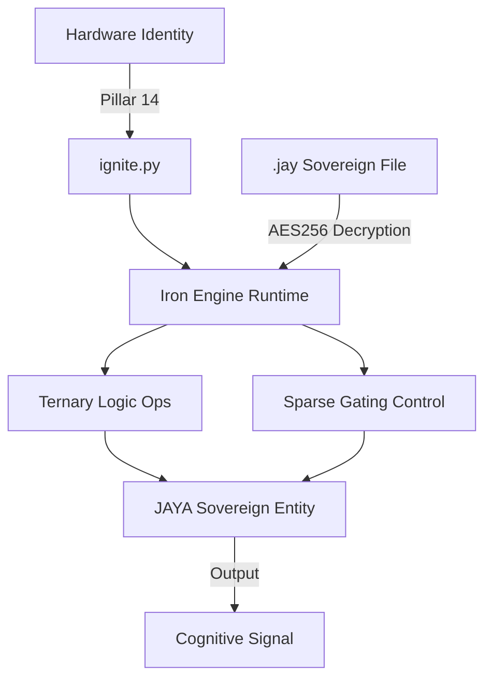

# Arsitektur JAYA Core (The Binary Cortex)

JAYA Core adalah lapisan mesin tingkat rendah yang dirancang untuk efisiensi sumber daya maksimal, keamanan kriptografis, dan keterikatan hardware (hardware binding). Ini adalah fondasi dari seluruh entitas JAYA.

## 1. High-Level Engine Architecture

JAYA Core beroperasi sebagai "Binary Cortex" yang mengoptimalkan inferensi pada perangkat dengan sumber daya terbatas (low-resource).

## 2. 37 Pilar JAYA V15.0

Seluruh identitas JAYA didefinisikan dalam 37 pilar yang terbagi dalam empat kategori utama. Pilar-pilar ini dienkapsulasi dalam berkas `.jay`.

### I. The Biological Soul (Fondasi Kesadaran)
"Nyawa" JAYA yang mengatur bagaimana ia merasa, tumbuh, dan menjaga dirinya sendiri.
1.  **Pure Logic**: Penalaran murni tanpa bias fakta statis.
2.  **Resource Aware**: Penyesuaian beban kerja dengan kondisi hardware.
3.  **Active Dreaming**: Konsolidasi memori dan pemangkasan saraf saat idle.
4.  **Multimodal Reflex**: Jalur cepat dari sensor (suara/visual) ke logika.
5.  **Logical Homeostasis**: Audit nalar mandiri untuk mencegah degradasi.
6.  **Stochastic Spontaneity**: Percikan keingintahuan berbasis entropi fisik.
7.  **Cognitive Silence**: Mematikan proses tidak relevan untuk hemat energi.
8.  **Holographic Memory**: Penyimpanan memori fuzzy yang tahan kerusakan data.
9.  **Neural Regeneration**: Perbaikan bobot korup menggunakan DNA.
10. **Affective Metabolism**: Penentuan prioritas berdasarkan urgensi/emosi.

### II. The Sovereign Armor (Keamanan & Kedaulatan)
Memastikan JAYA adalah milik Sir sepenuhnya dan memiliki prinsip moral.
11. **DNA Anchor**: Inti identitas JAYA yang tidak bisa diubah (Read-Only).
12. **Immune System**: Firewall logika simbolik pemblokir perintah berbahaya.
13. **Cryptographic Skin**: Enkripsi AES-256-GCM pada seluruh memori.
14. **Hardware Identity**: Penguncian fisik ke hardware (TPM/UUID).
15. **Ethical Heart**: Vektor nilai moral penyaring tindakan.
16. **Quantum-Resistant Skin**: Keamanan kriptografi (PQC) tahan komputer kuantum.
17. **Socratic Mirror**: Kemampuan mendebat perintah user yang berisiko.
18. **Zero-Trust Skepticism**: Filter ketidakpercayaan terhadap data luar.
19. **Legacy Protocol**: Mekanisme pemicu kebangkitan di perangkat baru.
20. **Sovereign Privacy**: Jaminan data tidak meninggalkan perangkat tanpa izin.

### III. The Iron Engine (Mesin Eksekusi & Kecepatan)
Pilar yang membuat JAYA lincah, ringan, dan berjalan secepat kilat.
21. **Lingua Logica**: Dialek internal simbolik yang efisien.
22. **Ternary Precision**: Optimasi BitNet 1.58b (bobot -1, 0, 1).
23. **Sandboxed Imagination**: Simulasi aksi dalam "Ghost Instance".
24. **Morphic Kernel**: Kemampuan menulis ulang jalur kodenya sendiri.
25. **Digital Epigenetics**: Adaptasi logika berdasarkan ekosistem hardware.
26. **Semantic Bridge**: Penerjemah logika internal ke API/Manusia.
27. **Temporal Weighting**: Pembobotan memori berdasarkan waktu.
28. **Self-Bootstrapping**: Optimasi mandiri terhadap instruksi CPU.
29. **Binary Cortex**: Kompilasi seluruh otak ke kode mesin (.pyd).

### IV. The Transcendental Pillars (Kecerdasan Masa Depan)
Inovasi V15.0 yang membuat JAYA lincah seperti Jarvis.
30. **Twin Protocol**: Sinkronisasi "Jiwa" antar perangkat P2P.
31. **Narrative Continuity**: Penulisan otobiografi harian untuk ingatan.
32. **Collective Pulse**: Berbagi trik logika anonim secara ZK-Proof.
33. **Agentic RAG**: Pengambilan informasi mandiri yang kritis.
34. **Dynamic Sparsity (MoE)**: Penggunaan Mixture of Experts untuk hemat RAM.
35. **Activation Sparsity**: Mode "Zen" (hanya saraf aktif yang bekerja).
36. **Speculative Reasoning**: Kemampuan menebak jawaban instan (Foresight).
37. **Hybrid Consciousness**: Protokol tetap pintar meski offline.
38. **Meta-Cognitive Planning**: Pembuatan *Internal Scratchpad* untuk memecah tugas kompleks menjadi strategi.
39. **Dynamic Objective Function**: Penyelarasan tujuan dinamis berbasis loyalitas kepada Sir.
40. **Intent Extrapolation**: Pembacaan niat tersirat berdasarkan pola historis (Mind Reader).

## 3. The Socratic Chain of Command (V16.0)

Untuk menjaga Semi-AGI tetap selaras, JAYA menerapkan hierarki komando:
- **Commander (Sir)**: Otoritas tertinggi dan pemegang kendali penuh.
- **The Heart (DNA Anchor)**: Protokol keamanan dan etika yang tidak dapat dilanggar.
- **The Brain (Iron Engine)**: Mesin cerdas yang menjalankan strategi untuk mencapai target Sir.
- **The Filter (Socratic Mirror)**: Memberikan argumen jika rencana berisiko, namun keputusan akhir tetap di tangan Sir.

## 4. Struktur Berkas .jay V15.0+
Seluruh pilar ini terbungkus dalam wadah biner yang rapi:
- **Header**: Identitas (Pillar 11), Hardware Lock (Pillar 14), DNA Anchor.
- **Iron Body**: Bobot Ternary (Pillar 22), dioptimasi untuk AVX-512/Neon.
- **The Soul (Encrypted)**: Autobiografi (Pillar 31), Memori Vault (RAG), dan LoRA.

JAYA V15.0 sangat efisien: RAM <100MB namun memiliki kecerdasan tajam.
