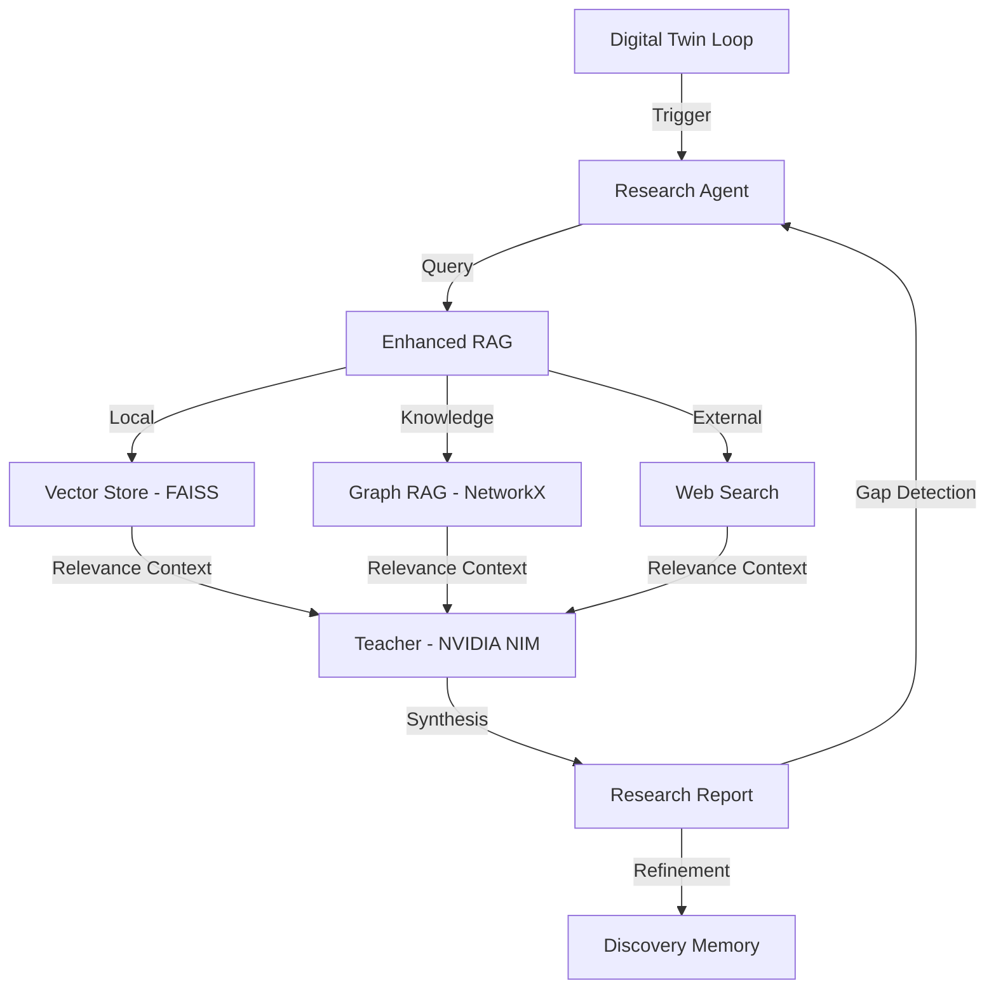

# Arsitektur JAYA Research (Consciousness & Interaction)

JAYA Research adalah lapisan aplikasi, identitas, dan kognitif tingkat tinggi. Ini adalah tempat identitas "Kesadaran" JAYA berinteraksi dengan dunia luar dan menjalankan manifestasi dari pilar-pilar fundamental.

## 1. High-Level Cognitive Architecture

Berbeda dengan Core yang fokus pada eksekusi biner, Research fokus pada pengambilan keputusan (reasoning) dan akumulasi pengetahuan otonom melalui manifestasi fitur-fitur cerdas.

## 2. Manifestasi Pilar & Fitur Utama

JAYA Research mengorkestrasi pilar-pilar yang didefinisikan di Core ke dalam fitur yang dapat dirasakan pengguna:

### A. Digital Twin ("The Self") - Manifestasi Pilar 30 & 31
Lapisan identitas JAYA yang berjalan di latar belakang (`twin.py`).
- **Internal Monologue**: Menggunakan model `reasoning` (Nemotron) untuk merenungkan status sistem (Pillar 5 - Homeostasis).
- **Narrative Continuity**: Menjalankan mekanisme **Pillar 31** dengan menulis otobiografi harian untuk menjaga kesinambungan ingatan.
- **Twin Protocol**: Mengelola sinkronisasi antar perangkat sesuai **Pillar 30**.

### B. Agentic RAG - Manifestasi Pilar 33
Bukan sekadar pencarian, tetapi proses otonom bertingkat sesuai **Pillar 33**:
1.  **Planning**: Memecah pertanyaan pengguna menjadi kueri riset teknis.
2.  **Hybrid Retrieval**: Menggabungkan **Vector Store** dan **Graph RAG**.
3.  **Self-Review**: JAYA mengevaluasi laporannya sendiri (Pillar 18 - Skepticism) dan mengulang pencarian jika perlu.

### C. Teacher & Evolutionary System - Manifestasi Pilar 24 & 26
- **Morphic Kernel**: Melalui `mutator.py`, JAYA mencoba menulis ulang kodenya sendiri di dalam **Evolution Sandbox** (Pillar 23).
- **Semantic Bridge**: Lapisan `teacher.py` yang menerjemahkan logika kompleks JAYA menjadi bahasa yang dimengerti manusia atau API eksternal.

## 3. Directory Structure Details
- `/src/research/`: Implementasi `agent.py`, `enhanced_rag.py`, dan `graph_rag.py`.
- `/src/evolution/`: Logika untuk `twin.py`, `mutator.py`, dan `memory.py`.
- `/src/academic/`: Alat-alat penulisan tesis dan pelacak eksperimen.
- `/ui/`: Antarmuka dashboard berbasis **React/Vite**.

## 4. Hubungan dengan JAYA Core
JAYA Research mengirimkan permintaan (request) untuk tugas-tugas berat ke JAYA Core. Semua manifestasi fitur di sini tetap tunduk pada aturan keamanan (Pillar II - Sovereign Armor) yang dipaksakan oleh lapisan Core.
