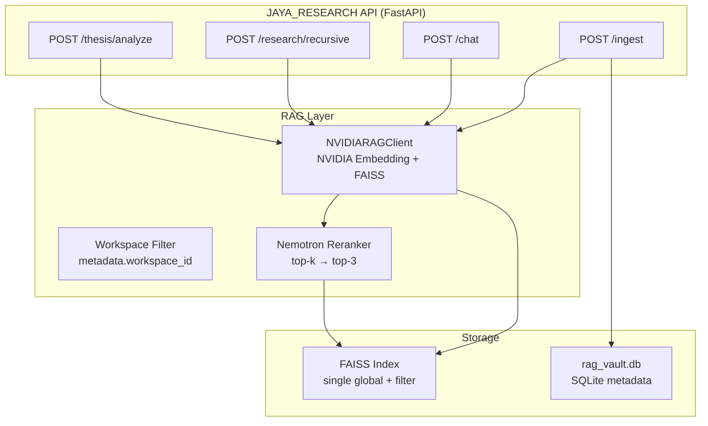
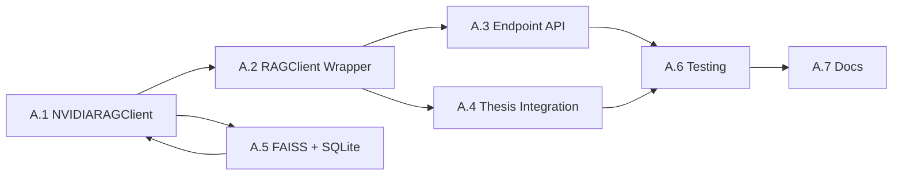

# Fase A — Fix RAG & API Completeness

> **Durasi:** 1–2 minggu  
> **Tujuan:** Mengembalikan fungsi RAG semantic (seperti v5) + workspace isolation, serta melengkapi endpoint API yang hilang agar UI thesis chat & research agent berfungsi end-to-end.

---

## Arsitektur Target Fase A

---

## Workflow & Checklist Atomik

### A.1 — Implementasi `NVIDIARAGClient` Lengkap

| # | Task | DoD | File Terkait | Status |
|---|------|-----|--------------|--------|
| A.1.1 | Buat class `NVIDIARAGClient` di `src/rag/nvidia_rag_client.py` | Class ada, inherit `BaseRAGClient`, method `embed()`, `search()`, `ingest_text()` | `src/rag/nvidia_rag_client.py` (baru) | ☐ |
| A.1.2 | Implement `embed(texts: List[str]) -> List[List[float]]` pakai NVIDIA NIM embedding API | Unit test: embed 3 kalimat → shape (3, 1024) | `src/rag/nvidia_rag_client.py` | ☐ |
| A.1.3 | Implement `ingest_text(text, metadata, workspace_id)` → simpan ke FAISS + SQLite | Integration test: ingest 1 chunk → `search()` menemukannya | `src/rag/nvidia_rag_client.py` | ☐ |
| A.1.4 | Implement `search(query, top_k, workspace_id, rerank=True)` | Return `List[Dict]` dengan `score`, `text`, `metadata` | `src/rag/nvidia_rag_client.py` | ☐ |
| A.1.5 | Tambah reranker Nemotron (opsional, bisa fase B) | Jika `rerank=True` → panggil NIM rerank endpoint | `src/rag/nvidia_rag_client.py` | ☐ |
| A.1.6 | Handle error: rate limit, timeout, SSL, empty response | Retry 3x exponential backoff, log structured | `src/rag/nvidia_rag_client.py` | ☐ |

### A.2 — Perbaiki `RAGClient` (Wrapper/Facade)

| # | Task | DoD | File Terkait | Status |
|---|------|-----|--------------|--------|
| A.2.1 | Refactor `src/rag/rag_client.py` → gunakan `NVIDIARAGClient` sebagai backend default | `RAGClient.ingest_text()` delegasi ke `NVIDIARAGClient` | `src/rag/rag_client.py` | ☐ |
| A.2.2 | Hapus keyword-search MVP (`evolution_memory.json`) | Tidak ada referensi `evolution_memory.json` di `rag_client.py` | `src/rag/rag_client.py` | ☐ |
| A.2.3 | Tambah parameter `workspace_id` ke semua public method | Signature: `search(query, top_k=5, workspace_id=None)` | `src/rag/rag_client.py` | ☐ |
| A.2.4 | Pastikan backward compatibility untuk kode lama | Test existing: `thesis_analyzer.py` masih jalan | `src/rag/rag_client.py` | ☐ |

### A.3 — Implementasi Endpoint API yang Hilang

| # | Task | DoD | File Terkait | Status |
|---|------|-----|--------------|--------|
| A.3.1 | `POST /ingest` di `research_api.py` | Body: `{text, metadata?, workspace_id?}` → return `{chunk_id, status}` | `src/api/research_api.py` | ☐ |
| A.3.2 | `POST /research/recursive` di `research_api.py` | Body: `{query, depth=3, workspace_id?}` → return synthesis + sources | `src/api/research_api.py` | ☐ |
| A.3.3 | Validasi request/response dengan Pydantic models | Models di `src/api/schemas.py` (baru atau update) | `src/api/schemas.py` | ☐ |
| A.3.3 | Error handling terpusat (HTTPException + logging) | Semua error return JSON `{detail, code}` konsisten | `src/api/research_api.py` | ☐ |

### A.4 — Integrasi Thesis Analyzer → RAG Baru

| # | Task | DoD | File Terkait | Status |
|---|------|-----|--------------|--------|
| A.4.1 | `thesis_analyzer.py` → gunakan `RAGClient.ingest_text()` saat upload PDF | Upload PDF → chunk → ingest → chat thesis jalan | `src/academic/thesis_analyzer.py` | ☐ |
| A.4.2 | Hapus warning "ingest_text not available" | Log tidak ada warning non-fatal | `src/academic/thesis_analyzer.py` | ☐ |
| A.4.3 | Chat thesis (`/thesis/chat`) pakai `RAGClient.search()` dengan `workspace_id` | Query thesis → return grounded answer + citations | `src/api/research_api.py` + `thesis_analyzer.py` | ☐ |

### A.5 — FAISS Index & SQLite Metadata (Single Global + Filter)

| # | Task | DoD | File Terkait | Status |
|---|------|-----|--------------|--------|
| A.5.1 | Desain skema `rag_vault.db`: `chunks(id, workspace_id, text, embedding_id, metadata_json, created_at)` | Migration script + SQLAlchemy model | `src/rag/models.py` (baru) | ☐ |
| A.5.2 | FAISS index global (bukan per workspace) + filter `workspace_id` di metadata | Search 10k chunks → filter workspace < 50 ms | `src/rag/nvidia_rag_client.py` | ☐ |
| A.5.3 | Persist FAISS index ke disk (`faiss_index.bin`) + load saat startup | Restart server → index tersedia tanpa re-ingest | `src/rag/nvidia_rag_client.py` | ☐ |
| A.5.4 | Cleanup: hapus logika workspace-isolated index lama | Tidak ada `faiss_index_{workspace_id}.bin` | `src/rag/` | ☐ |

### A.6 — Testing & Evaluasi RAG

| # | Task | DoD | File Terkait | Status |
|---|------|-----|--------------|--------|
| A.6.1 | Unit test `NVIDIARAGClient` (mock NIM API) | `pytest JAYA_RESEARCH/tests/test_nvidia_rag_client.py -v` pass | `tests/test_nvidia_rag_client.py` (baru) | ☐ |
| A.6.2 | Integration test: ingest → search → delete (jika ada) | `tests/test_rag_integration.py` | `tests/test_rag_integration.py` (baru) | ☐ |
| A.6.3 | Benchmark RAG recall@5 dengan ground truth thesis PDF (min 3 dokumen) | Script `scripts/eval_rag_recall.py` → output JSON | `scripts/eval_rag_recall.py` (baru) | ☐ |
| A.6.4 | Target recall@5 ≥ 0.80 (baseline v6 ~0.60) | Catat hasil di `docs/roadmap/phase-A/CHECKLIST.md` | `docs/roadmap/phase-A/CHECKLIST.md` | ☐ |

### A.7 — Dokumentasi & Changelog

| # | Task | DoD | File Terkait | Status |
|---|------|-----|--------------|--------|
| A.7.1 | Update `docs/roadmap/phase-A/CHECKLIST.md` dengan status final | Semua ☐ → ☑ | `docs/roadmap/phase-A/CHECKLIST.md` | ☐ |
| A.7.2 | Update `CHANGELOG.md` root dengan ringkasan Fase A | Format: `## [Unreleased] - Phase A` | `CHANGELOG.md` | ☐ |
| A.7.3 | Update `README.md` JAYA_RESEARCH: hapus catatan "RAG belum siap" | README akurat | `JAYA_RESEARCH/README.md` | ☐ |

---

## Dependencies Antar Workflow

**Critical Path:** A.1 → A.2 → A.3/A.4 → A.6 → A.7  
**Parallelizable:** A.5 bisa mulai bersamaan A.1 (skema DB independen).

---

## Estimasi Effort (Story Points / Ideal Days)

| Workflow | SP | Ideal Days | Catatan |
|----------|----|------------|---------|
| A.1 | 8 | 2–3 | Core baru, butuh mock NIM |
| A.2 | 3 | 0.5 | Refactor ringan |
| A.3 | 5 | 1–1.5 | Endpoint + schema + error handling |
| A.4 | 3 | 0.5 | Integrasi existing |
| A.5 | 5 | 1–1.5 | DB + FAISS persist |
| A.6 | 5 | 1–2 | Test + benchmark script |
| A.7 | 2 | 0.5 | Docs |
| **Total** | **31** | **7–10 hari** | ~1.5–2 minggu |

---

## Exit Criteria Fase A (Definition of Done)

- [ ] Semua checklist A.1–A.7 ☑
- [ ] `pytest JAYA_RESEARCH/tests/ -v` pass (termasuk test baru)
- [ ] `POST /ingest` & `POST /research/recursive` return 200 di Swagger UI
- [ ] Upload PDF thesis → chat thesis menjawab grounded (bukan hallucinasi)
- [ ] RAG recall@5 ≥ 0.80 pada 3 thesis PDF test
- [ ] Restart server → FAISS index load otomatis, data thesis tetap searchable
- [ ] Tidak ada warning "ingest_text not available" di log

---

> **Next:** Setelah Fase A selesai, lanjut ke [Fase B — Production Hardening](../phase-B/README.md).