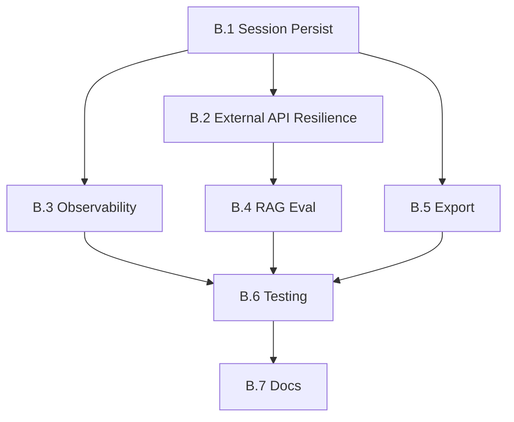

# Fase B — Production Hardening Thesis Workflow

> **Durasi:** 2–3 minggu  
> **Tujuan:** Mengubah thesis analyzer dari prototype (in-memory, fragile) menjadi sistem produksi yang *reliable*, *observable*, dan *resilient* terhadap failure eksternal.

---

## Arsitektur Target Fase B

```mermaid
flowchart TD
    subgraph API["JAYA_RESEARCH API"]
        THS_UP[POST /thesis/upload]
        THS_ANA[POST /thesis/analyze]
        THS_CHAT[POST /thesis/chat]
        THS_PROG[GET /thesis/progress/{session_id}]
        THS_WS[WS /thesis/ws/{session_id}]
    end

    subgraph WORKER["Background Workers (Celery / RQ / asyncio)"]
        PDF_EXT[PDF Extraction]
        META[Meta Analysis]
        NOVEL[Novelty Check]
        GAP[Gap Finder]
        REV[Reviewer]
        DEF[Defense Prep]
    end

    subgraph PERSIST["Persistence Layer"]
        SQLITE[(SQLite: thesis_sessions<br/>+ progress + results)]
        REDIS[(Redis: task queue<br/>+ pub/sub progress)]
        FILES[File Storage<br/>uploads/ + exports/]
    end

    subgraph EXTERNAL["External APIs"]
        ARXIV[ArXiv API]
        SEMANTIC[Semantic Scholar]
        CROSSREF[Crossref]
        GARUDA[GARUDA]
        NIM[NVIDIA NIM]
    end

    THS_UP --> PDF_EXT --> SQLITE
    THS_ANA --> META --> NOVEL --> GAP --> REV --> DEF
    META --> ARXIV
    META --> SEMANTIC
    NOVEL --> CROSSREF
    NOVEL --> GARUDA
    REV --> NIM
    DEF --> NIM
    WORKER --> REDIS --> THS_PROG
    WORKER --> REDIS --> THS_WS
    SQLITE --> THS_CHAT
```

---

## Workflow & Checklist Atomik

### B.1 — Persistensi Session (SQLite + Redis)

| # | Task | DoD | File Terkait | Status |
|---|------|-----|--------------|--------|
| B.1.1 | Desain skema `thesis_sessions` table: `id, user_id, filename, status, progress_json, results_json, created_at, updated_at` | Migration + SQLAlchemy model `src/academic/models.py` | `src/academic/models.py` (baru/update) | ☐ |
| B.1.2 | Ganti `_thesis_sessions` dict in-memory → SQLite CRUD | `ThesisSessionManager` class dengan `create, get, update, list` | `src/academic/thesis_session.py` (baru) | ☐ |
| B.1.3 | Integrasi Redis untuk task queue (Celery/RQ) + pub/sub progress | `celery_app.py` + `tasks/thesis_tasks.py` | `src/workers/celery_app.py`, `src/workers/thesis_tasks.py` | ☐ |
| B.1.4 | Background job: analisis 5 langkah jadi task terpisah (chain/group) | Celery chain: `extract → meta → novelty → gap → review → defense` | `src/workers/thesis_tasks.py` | ☐ |
| B.1.5 | Progress tracking: publish ke Redis channel `thesis:{session_id}:progress` | Frontend bisa subscribe via SSE/WebSocket | `src/workers/thesis_tasks.py` | ☐ |
| B.1.6 | REST endpoint `GET /thesis/progress/{session_id}` + `WS /thesis/ws/{session_id}` | Return JSON progress / WebSocket push real-time | `src/api/research_api.py` | ☐ |

### B.2 — Resilience External API (ArXiv, Semantic Scholar, Crossref, GARUDA)

| # | Task | DoD | File Terkait | Status |
|---|------|-----|--------------|--------|
| B.2.1 | Wrapper class `ExternalAPIClient` dengan retry, timeout, circuit breaker | Base class di `src/external/api_client.py` | `src/external/api_client.py` (baru) | ☐ |
| B.2.2 | Implement `ArXivClient` → enable SSL verify (hapus `verify=False`) | SSL verify=True, pin cert jika perlu | `src/external/arxiv_client.py` | ☐ |
| B.2.3 | Implement `SemanticScholarClient` dengan rate limit handling | Respect `Retry-After` header, exponential backoff | `src/external/semantic_scholar_client.py` | ☐ |
| B.2.4 | Implement `CrossrefClient` + `GARUDAClient` | Same resilience pattern | `src/external/crossref_client.py`, `src/external/garuda_client.py` | ☐ |
| B.2.5 | Circuit breaker: setelah 5 failure berturut-turut → open 60s → half-open | `pybreaker` atau custom state machine | `src/external/api_client.py` | ☐ |
| B.2.6 | Fallback chain: ArXiv → Semantic Scholar → Crossref → GARUDA | `LiteratureSearcher` urutkan prioritas | `src/academic/literature.py` | ☐ |

### B.3 — Observability & Logging Terstruktur

| # | Task | DoD | File Terkait | Status |
|---|------|-----|--------------|--------|
| B.3.1 | Structured logging (JSON) dengan `structlog` / `python-json-logger` | Semua log: `timestamp, level, session_id, task, message, context` | `src/core/logging.py` (baru) | ☐ |
| B.3.2 | Correlation ID: generate `request_id` per HTTP request, propagate ke worker | Middleware FastAPI + Celery task headers | `src/api/middleware.py`, `src/workers/celery_app.py` | ☐ |
| B.3.3 | Metrics: Prometheus counters (requests, errors, latency, queue depth) | `/metrics` endpoint, Grafana dashboard opsional | `src/core/metrics.py` | ☐ |
| B.3.4 | Health check endpoint `GET /health` + `GET /health/ready` | DB, Redis, NIM connectivity check | `src/api/health.py` | ☐ |

### B.4 — Evaluasi Formal RAG (Lanjutan Fase A)

| # | Task | DoD | File Terkait | Status |
|---|------|-----|--------------|--------|
| B.4.1 | Buat ground truth dataset: 10 thesis PDF + 50 QA pairs per thesis | Format: `eval/ground_truth/{thesis_id}/qa.jsonl` | `eval/ground_truth/` (baru) | ☐ |
| B.4.2 | Script evaluasi lengkap: `scripts/eval_rag_full.py` (recall@k, MRR, latency, groundedness) | Output JSON + HTML report | `scripts/eval_rag_full.py` (baru) | ☐ |
| B.4.3 | Target Fase B: recall@5 ≥ 0.85, MRR ≥ 0.70, p95 latency < 2s | Catat hasil di CHECKLIST | `docs/roadmap/phase-B/CHECKLIST.md` | ☐ |
| B.4.4 | Regression test: CI jalankan evaluasi otomatis (sample kecil) | GitHub Actions / local script | `.github/workflows/rag-eval.yml` | ☐ |

### B.5 — Export & Reporting Thesis

| # | Task | DoD | File Terkait | Status |
|---|------|-----|--------------|--------|
| B.5.1 | Export Markdown lengkap: meta + novelty + gap + review + defense + citations | `ThesisExporter.to_markdown(session_id)` | `src/academic/exporter.py` | ☐ |
| B.5.2 | Export PDF (via WeasyPrint / pandoc) | `ThesisExporter.to_pdf(session_id)` | `src/academic/exporter.py` | ☐ |
| B.5.3 | Export JSON (raw results untuk integrasi lain) | `ThesisExporter.to_json(session_id)` | `src/academic/exporter.py` | ☐ |
| B.5.4 | Endpoint `GET /thesis/export/{session_id}?format=md|pdf|json` | Return file download | `src/api/research_api.py` | ☐ |

### B.6 — Testing & Quality Gate

| # | Task | DoD | File Terkait | Status |
|---|------|-----|--------------|--------|
| B.6.1 | Unit test `ThesisSessionManager` (CRUD, progress update) | `pytest tests/test_thesis_session.py -v` | `tests/test_thesis_session.py` | ☐ |
| B.6.2 | Integration test: upload → background analysis → progress WS → export | `tests/test_thesis_e2e.py` | `tests/test_thesis_e2e.py` | ☐ |
| B.6.3 | Chaos test: kill worker mid-analysis → resume dari checkpoint | Simulate SIGTERM, verify resume | `tests/test_thesis_resilience.py` | ☐ |
| B.6.4 | Load test: 10 concurrent thesis upload → analisis | Locust / k6 script, target p95 < 30s per thesis | `tests/load_test_thesis.py` | ☐ |

### B.7 — Dokumentasi & Changelog

| # | Task | DoD | File Terkait | Status |
|---|------|-----|--------------|--------|
| B.7.1 | Update `docs/roadmap/phase-B/CHECKLIST.md` final status | All ☑ | `docs/roadmap/phase-B/CHECKLIST.md` | ☐ |
| B.7.2 | Update root `CHANGELOG.md` dengan ringkasan Fase B | Format: `## [Unreleased] - Phase B` | `CHANGELOG.md` | ☐ |
| B.7.3 | Update `JAYA_RESEARCH/README.md`: production- Production- Production-ready thesis workflow- Architecture diagram- API docs link | README akurat | `JAYA_RESEARCH/README.md` | ☐ |

---

## Dependencies Antar Workflow



**Critical Path:** B.1 → B.2 → B.4 → B.6 → B.7  
**Parallelizable:** B.3, B.5 bisa jalan bersamaan B.2.

---

## Estimasi Effort

| Workflow | SP | Ideal Days | Catatan |
|----------|----|------------|---------|
| B.1 | 13 | 3–4 | Core infrastructure |
| B.2 | 8 | 2–3 | 4 external clients |
| B.3 | 5 | 1–2 | Logging + metrics |
| B.4 | 8 | 2–3 | Ground truth + eval script |
| B.5 | 5 | 1–2 | Exporter + endpoint |
| B.6 | 8 | 2–3 | Test suite lengkap |
| B.7 | 2 | 0.5 | Docs |
| **Total** | **49** | **11–17 hari** | ~2–3 minggu |

---

## Exit Criteria Fase B

- [ ] Semua checklist B.1–B.7 ☑
- [ ] `pytest JAYA_RESEARCH/tests/ -v` pass (termasuk test baru)
- [ ] Upload thesis → background analysis jalan → progress real-time via WS
- [ ] Kill worker mid-analysis → resume otomatis dari checkpoint
- [ ] External API failure (ArXiv down) → fallback ke Semantic Scholar → hasil tetap ada
- [ ] RAG recall@5 ≥ 0.85 pada 10 thesis ground truth
- [ ] Export MD/PDF/JSON berfungsi, file valid
- [ ] Health check `/health/ready` return 200 hanya jika DB+Redis+NIM ready
- [ ] Structured JSON log dengan correlation ID terlihat di log aggregator

---

> **Next:** Setelah Fase B selesai, lanjut ke [Fase C — Distillation & Local Student](../phase-C/README.md).