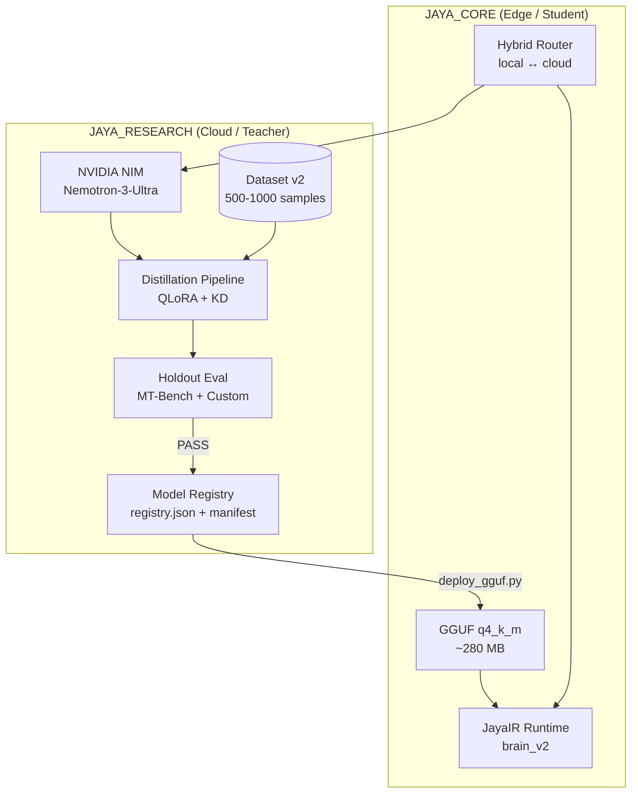
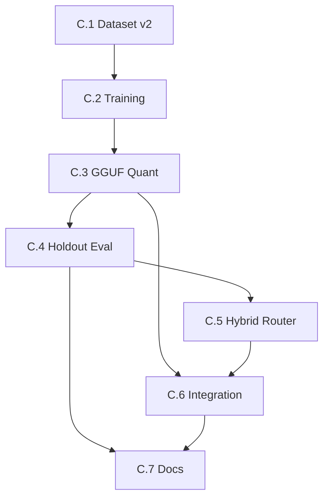

# Fase C — Distillation Pipeline & Local Student Model

> **Durasi:** 1 bulan (4 sprint × 1 minggu)  
> **Tujuan:** Menghasilkan student model GGUF q4_k_m < 300 MB yang bisa jalan offline di laptop, dengan pipeline distillation yang reproducible, evaluasi holdout, dan router hybrid lokal↔cloud.

---

## Arsitektur Target Fase C

---

## Workflow & Checklist Atomik

### C.1 — Dataset Distillation v2 (Target: 500–1000 samples)

| # | Task | DoD | File Terkait | Status |
|---|------|-----|--------------|--------|
| C.1.1 | Desain skema dataset v2: `instruction`, `input`, `output`, `source`, `quality_score`, `split` | JSON Schema + contoh 5 record | `JAYA_RESEARCH/data/distill/v2/schema.json` | ☐ |
| C.1.2 | Pipeline generate dari NIM: `scripts/generate_distill_data.py` — prompt templates untuk QA, reasoning, coding, academic | Script jalan, output 200 sampel/jam | `JAYA_RESEARCH/scripts/generate_distill_data.py` | ☐ |
| C.1.3 | Pipeline generate dari Ollama local (fallback): `scripts/generate_local_distill.py` | Output format sama v2 | `JAYA_RESEARCH/scripts/generate_local_distill.py` | ☐ |
| C.1.4 | Anonimisasi thesis PDF → QA pairs (PII removal, chunking) | 50+ thesis → 200+ QA | `JAYA_RESEARCH/scripts/thesis_to_qa.py` | ☐ |
| C.1.5 | Quality filter: LLM-as-judge (NIM) score ≥ 7/10, deduplicate (embedding sim < 0.9) | Dataset bersih 500–1000 | `JAYA_RESEARCH/scripts/filter_distill_data.py` | ☐ |
| C.1.6 | Split train/val/test (80/10/10) stratified by source + task type | `train.jsonl`, `val.jsonl`, `test.jsonl` | `JAYA_RESEARCH/data/distill/v2/` | ☐ |
| C.1.7 | Versioning dataset ke DVC / Git LFS + manifest SHA256 | `dvc push` / `git lfs push` | `JAYA_RESEARCH/data/distill/v2/` | ☐ |

### C.2 — Training Pipeline (QLoRA + Knowledge Distillation)

| # | Task | DoD | File Terkait | Status |
|---|------|-----|--------------|--------|
| C.2.1 | Refactor `train_qlora.py` → support multi-stage: SFT → KD (logits) → DPO (optional) | Single script, config-driven | `JAYA_RESEARCH/scripts/train_distill.py` | ☐ |
| C.2.2 | Base model: Qwen2.5-0.5B-Instruct (student), Qwen3-4B-Instruct (teacher adapter) | Config `model.student`, `model.teacher` | `JAYA_RESEARCH/configs/train_distill.yaml` | ☐ |
| C.2.3 | QLoRA config: 4-bit NF4, r=64, alpha=16, target_modules=all-linear | VRAM < 6GB (T4/3060) | `JAYA_RESEARCH/configs/qlora.yaml` | ☐ |
| C.2.4 | Knowledge Distillation loss: `L = α*CE + (1-α)*KL(logits_teacher || logits_student)` | α=0.5 default, tunable | `JAYA_RESEARCH/src/training/distill_loss.py` | ☐ |
| C.2.5 | Training loop: gradient accumulation, gradient checkpointing, wandb logging | 3 epoch, log step 10 | `JAYA_RESEARCH/scripts/train_distill.py` | ☐ |
| C.2.6 | Checkpoint callback: save best val loss + last | `adapter_best/`, `adapter_last/` | `JAYA_RESEARCH/scripts/train_distill.py` | ☐ |
| C.2.7 | Merge adapter → base model (FP16) → `merged_model/` | `merge_adapter.py` jalan | `JAYA_RESEARCH/scripts/merge_adapter.py` | ☐ |

### C.3 — GGUF Conversion & Quantization (Target: q4_k_m < 300 MB)

| # | Task | DoD | File Terkait | Status |
|---|------|-----|--------------|--------|
| C.3.1 | Setup llama.cpp build di Windows (WSL2 + CMake) atau gunakan pre-built | `llama-quantize` jalan | `JAYA_CORE/llama.cpp/` | ☐ |
| C.3.2 | Convert merged FP16 → GGUF f16 (`llama-gguf-convert.py`) | `model-f16.gguf` ~950 MB | `JAYA_CORE/scripts/convert_gguf.py` | ☐ |
| C.3.3 | Quantize f16 → q8_0, q6_k, q5_k_m, q4_k_m, q3_k_m | Semua varian ada | `JAYA_CORE/scripts/quantize_all.sh` | ☐ |
| C.3.4 | Benchmark perplexity + latency tiap quant (prompt 512 tok, gen 256 tok) | Tabel CSV + plot | `JAYA_CORE/scripts/bench_quant.py` | ☐ |
| C.3.5 | Pilih q4_k_m sebagai default edge (size < 300 MB, ppl delta < 5% vs f16) | Keputusan terdokumentasi | `JAYA_CORE/docs/quant_selection.md` | ☐ |
| C.3.6 | Copy q4_k_m ke `JAYA_CORE/models/student-q4_k_m.gguf` + update `registry.json` | Registry entry `distilled-student-qwen-0.5b-v2` | `JAYA_CORE/registry.json` | ☐ |

### C.4 — Holdout Evaluation & Regression Gate

| # | Task | DoD | File Terkait | Status |
|---|------|-----|--------------|--------|
| C.4.1 | Evaluasi holdout test set (1000 sampel): MT-Bench, MMLU, Custom Academic QA | Skor JSON per task | `JAYA_RESEARCH/scripts/eval_holdout.py` | ☐ |
| C.4.2 | Bandingkan student v2 vs v1 (distilled-student-qwen-0.5b-v1) + baseline Qwen2.5-0.5B | Tabel perbandingan | `JAYA_RESEARCH/docs/eval_comparison_v1_v2.md` | ☐ |
| C.4.3 | Regression gate: student v2 harus ≥ v1 di semua metrik akademik | Gate PASS/FAIL | `JAYA_CORE/tests/test_phase2_distill_gate.py` (baru) | ☐ |
| C.4.4 | Evaluasi latency & memory di target device (laptop 16GB RAM, no GPU) | p50, p95, VRAM/RAM | `JAYA_CORE/scripts/bench_edge.py` | ☐ |
| C.4.5 | Catat manifest HMAC-SHA256 untuk model v2 (seperti phase 2) | `manifest_v2.json` + sig | `JAYA_CORE/scripts/build_manifest.py` | ☐ |

### C.5 — Hybrid Router (Local ↔ Cloud)

| # | Task | DoD | File Terkait | Status |
|---|------|-----|--------------|--------|
| C.5.1 | Desain router policy: heuristic (token count, complexity, privacy) + learned (tiny classifier) | Doc `router_policy.md` | `JAYA_CORE/docs/router_policy.md` | ☐ |
| C.5.2 | Implement `HybridRouter` di `JAYA_CORE/src/brain_v2/router.py` | Class + unit test | `JAYA_CORE/src/brain_v2/router.py` | ☐ |
| C.5.3 | Local path: load GGUF via `llama-cpp-python` → generate | `generate_local()` | `JAYA_CORE/src/brain_v2/local_backend.py` | ☐ |
| C.5.4 | Cloud path: call NIM API (existing `teacher.py`) | `generate_cloud()` | `JAYA_CORE/src/brain_v2/cloud_backend.py` | ☐ |
| C.5.5 | Fallback chain: local → cloud (timeout/error) → cached response | Resilience test pass | `JAYA_CORE/src/brain_v2/router.py` | ☐ |
| C.5.6 | Expose via JayaIR opcode `ROUTE` + CLI `jaya chat --auto` | End-to-end demo | `JAYA_CORE/scripts/jaya_chat_cli.py` | ☐ |

### C.6 — Integration JAYA_RESEARCH ↔ JAYA_CORE

| # | Task | DoD | File Terkait | Status |
|---|------|-----|--------------|--------|
| C.6.1 | JAYA_RESEARCH chat endpoint: optional `model=local|cloud|auto` | `/chat?model=auto` jalan | `JAYA_RESEARCH/src/api/research_api.py` | ☐ |
| C.6.2 | Sync student model ke JAYA_RESEARCH via LAN (rsync/HTTP) | `scripts/sync_model.sh` | `JAYA_RESEARCH/scripts/sync_model.sh` | ☐ |
| C.6.3 | UI toggle "Local Mode" di React (offline indicator) | Toggle jalan | `JAYA_RESEARCH/ui/src/components/ChatToggle.tsx` | ☐ |

### C.7 — Documentation & Changelog

| # | Task | DoD | File Terkait | Status |
|---|------|-----|--------------|--------|
| C.7.1 | Update `docs/roadmap/phase-C/CHECKLIST.md` final | All ☑ | This file | ☐ |
| C.7.2 | Update root `CHANGELOG.md` Phase C summary | | `CHANGELOG.md` | ☐ |
| C.7.3 | Update `JAYA_CORE/README.md` — student model specs, router usage | | `JAYA_CORE/README.md` | ☐ |
| C.7.4 | Update `JAYA_RESEARCH/README.md` — hybrid mode, local fallback | | `JAYA_RESEARCH/README.md` | ☐ |

---

## Dependencies Antar Workflow

**Critical Path:** C.1 → C.2 → C.3 → C.4 → C.5 → C.6 → C.7  
**Parallelizable:** C.3.1 (llama.cpp setup) bisa mulai awal; C.6.1 (API param) bisa paralel C.5.

---

## Estimasi Effort

| Workflow | SP | Ideal Days | Catatan |
|----------|----|------------|---------|
| C.1 | 21 | 5–7 | Data engineering heavy |
| C.2 | 21 | 5–7 | Training loop + KD loss |
| C.3 | 13 | 3–4 | llama.cpp Windows build tricky |
| C.4 | 13 | 3–4 | Eval suite lengkap |
| C.5 | 13 | 3–4 | Router + dual backend |
| C.6 | 8 | 2 | Integration |
| C.7 | 5 | 1 | Docs |
| **Total** | **94** | **22–29 hari** | ~1 bulan |

---

## Exit Criteria Fase C (Definition of Done)

- [ ] Semua checklist C.1–C.7 ☑
- [ ] `pytest JAYA_CORE/tests/test_phase2_distill_gate.py -v` PASS
- [ ] Student model q4_k_m < 300 MB, load < 2s di laptop 16GB RAM
- [ ] Hybrid router: local mode jalan offline total (WiFi off), cloud fallback saat online
- [ ] Holdout eval: student v2 ≥ v1 di academic QA, MT-Bench, MMLU subset
- [ ] JAYA_RESEARCH chat dengan `model=auto` route ke local saat offline
- [ ] Manifest v2 signed, registry.json updated, GGUF deployed ke `JAYA_CORE/models/`
- [ ] Dokumentasi lengkap: cara train, cara quantize, cara jalan local, router policy

---

## Blocker / Risk Log

| Date | Risk | Likelihood | Impact | Mitigation |
|------|------|------------|--------|------------|
| | llama.cpp build Windows gagal | High | High | Gunakan WSL2 / pre-built binary / CI GitHub Actions |
| | Dataset quality rendah → student overfit | Medium | High | LLM-as-judge filter ketat, human review 10% sample |
| | KD loss tidak konvergen | Medium | Medium | Tuning α, temperature, cek logits teacher |
| | q4_k_m terlalu degradasi vs f16 | Low | High | Fallback q5_k_m (~350 MB) masih < 400 MB |

---

> **Next:** Setelah Fase C selesai → [Fase D — Bridge & Advanced Features](../phase-D/README.md)