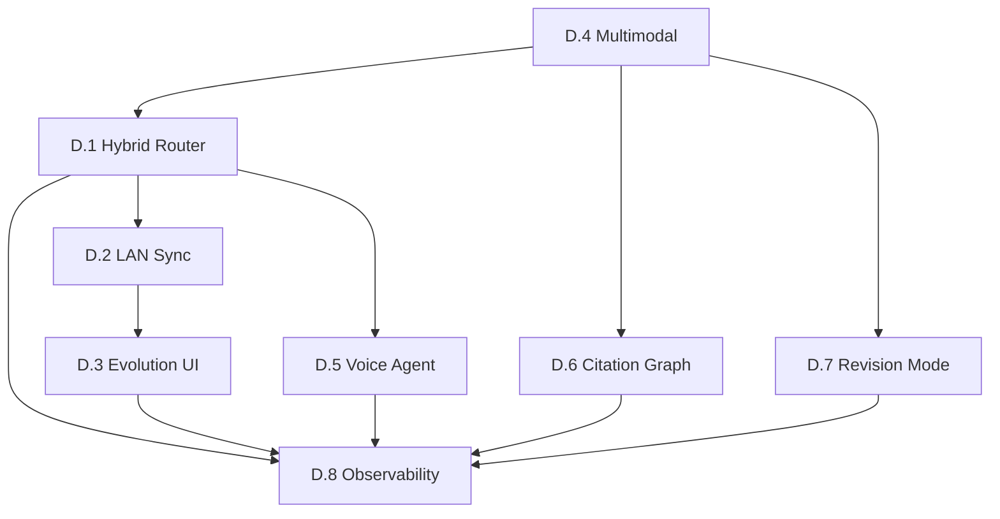

# Fase D — Bridge CORE↔RESEARCH + Advanced Features

> **Durasi:** Ongoing (iteratif, per sprint 2 minggu)  
> **Tujuan:** Menyatukan dua lapisan JAYA menjadi sistem koheren *offline-first* dengan fitur akademik lanjutan, multimodal, voice, dan observability penuh.

---

## Arsitektur Target Fase D

```mermaid
flowchart TD
    subgraph USER["User Interface"]
        UI[React UI<br/>JAYA_RESEARCH/ui]
        CLI[CLI / TUI<br/>JAYA_CORE/scripts]
        VOICE[Voice Agent<br/>JAYA_RESEARCH/src/voice]
    end

    subgraph ROUTER["Unified Router (Hybrid)"]
        POLICY[Policy Engine<br/>local ↔ cloud]
        CACHE[Semantic Cache<br/>Redis + FAISS]
    end

    subgraph CLOUD["JAYA_RESEARCH (Teacher / Cloud)"]
        NIM[NVIDIA NIM<br/>Nemotron-3-Ultra]
        RAG_CLOUD[RAG Cloud<br/>FAISS + NIM Embed]
        AGENT[Research Agent<br/>Recursive + Graph]
        THESIS[Thesis Analyzer<br/>Production-ready]
    end

    subgraph EDGE["JAYA_CORE (Student / Edge)"]
        GGUF[GGUF q4_k_m / q8_0<br/>~280 MB / ~500 MB]
        BRAIN[JayaIR Runtime<br/>brain_v2]
        RAG_EDGE[RAG Edge<br/>rag_vault.db + FAISS]
        EVOL[Evolution Engine<br/>Gate + Manifest + Rollback]
    end

    subgraph SYNC["LAN Sync (Optional)"]
        SYNC[Delta Sync<br/>rag_vault ↔ workspace]
        REG[Model Registry Sync<br/>registry.json + manifest]
    end

    UI --> ROUTER
    CLI --> ROUTER
    VOICE --> ROUTER
    ROUTER --> POLICY -->|simple query| GGUF
    ROUTER --> POLICY -->|complex query| NIM
    ROUTER --> CACHE
    GGUF --> BRAIN
    BRAIN --> RAG_EDGE
    NIM --> RAG_CLOUD
    NIM --> AGENT
    NIM --> THESIS
    SYNC -.-> RAG_EDGE
    SYNC -.-> RAG_CLOUD
    REG -.-> EVOL
```

---

## Workflow & Checklist Atomik

### D.1 — Unified Hybrid Router (Local ↔ Cloud)

| # | Task | DoD | File Terkait | Status |
|---|------|-----|--------------|--------|
| D.1.1 | Desain policy engine: rule-based (token count, complexity, privacy flag) + learned router (tiny classifier) | Spec doc `docs/architecture/router_policy.md` | `docs/architecture/router_policy.md` | ☐ |
| D.1.2 | Implement `HybridRouter` class di `JAYA_CORE/src/router/hybrid_router.py` | Route(query) → `local` \| `cloud` + confidence | `JAYA_CORE/src/router/hybrid_router.py` | ☐ |
| D.1.3 | Integrasi ke `JAYA_RESEARCH` chat endpoint: `/chat` → router → local GGUF atau NIM | Swagger UI: toggle "Local Only" mode | `JAYA_RESEARCH/src/api/research_api.py` | ☐ |
| D.1.4 | Semantic cache (Redis + FAISS) untuk dedup query cloud | Hit rate ≥ 30% pada workload thesis chat | `JAYA_CORE/src/cache/semantic_cache.py` | ☐ |
| D.1.5 | Fallback chain: local → cache → cloud → error response | Graceful degradation, log reason | `JAYA_CORE/src/router/hybrid_router.py` | ☐ |
| D.1.6 | Metrics: router decision distribution, latency local vs cloud, cache hit rate | Prometheus + Grafana dashboard | `JAYA_CORE/src/router/metrics.py` | ☐ |

### D.2 — LAN Knowledge Sync (Delta Sync rag_vault ↔ Workspace)

| # | Task | DoD | File Terkait | Status |
|---|------|-----|--------------|--------|
| D.2.1 | Desain protocol sync: Merkle tree / content hash per chunk, push/pull delta | Spec `docs/architecture/lan_sync.md` | `docs/architecture/lan_sync.md` | ☐ |
| D.2.2 | Implement `SyncAgent` di `JAYA_CORE/src/sync/sync_agent.py` | CLI: `jaya-sync push --peer <ip>`, `pull` | `JAYA_CORE/src/sync/sync_agent.py` | ☐ |
| D.2.3 | Integrasi ke `JAYA_RESEARCH` workspace: auto-sync on ingest / manual trigger | UI button "Sync to Edge" | `JAYA_RESEARCH/ui/src/components/SyncPanel.tsx` | ☐ |
| D.2.4 | Conflict resolution: last-write-wins + manual merge UI untuk konflik | Test: concurrent edit same chunk | `JAYA_CORE/src/sync/conflict.py` | ☐ |
| D.2.5 | Security: mTLS / pre-shared key untuk LAN sync | `openssl` cert gen script | `JAYA_CORE/scripts/gen_sync_certs.sh` | ☐ |

### D.3 — Evolution UI (Real-time Registry & Gate Status)

| # | Task | DoD | File Terkait | Status |
|---|------|-----|--------------|--------|
| D.3.1 | React page `/evolution` di `JAYA_RESEARCH/ui` | Table: policy, status, gain, manifest hash, GGUF size | `JAYA_RESEARCH/ui/src/pages/Evolution.tsx` | ☐ |
| D.3.2 | WebSocket feed dari `JAYA_CORE` evolution gate (promote, rollback, deploy) | Real-time status badge | `JAYA_CORE/src/evolution/ws_feed.py` | ☐ |
| D.3.3 | One-click "Promote to Edge" → trigger `promote_gguf.py` via API | Button → progress bar → success toast | `JAYA_RESEARCH/ui/src/api/evolution.ts` | ☐ |
| D.3.4 | Visualisasi lineage: base → adapter → merged → GGUF (graph) | Cytoscape.js / react-flow | `JAYA_RESEARCH/ui/src/components/ModelLineage.tsx` | ☐ |

### D.4 — Multimodal PDF (Table, Figure, Formula Extraction)

| # | Task | DoD | File Terkait | Status |
|---|------|-----|--------------|--------|
| D.4.1 | Integrasi `nv-ingest` (NVIDIA) untuk PDF → structured JSON (text, table, image, formula) | Output JSON schema documented | `JAYA_RESEARCH/src/multimodal/nv_ingest_wrapper.py` | ☐ |
| D.4.2 | Table → Markdown/CSV converter + embedding untuk RAG | Table QA benchmark ≥ 80% accuracy | `JAYA_RESEARCH/src/multimodal/table_processor.py` | ☐ |
| D.4.3 | Figure → caption generation (VLM) + embedding | Figure search by caption | `JAYA_RESEARCH/src/multimodal/figure_processor.py` | ☐ |
| D.4.4 | Formula → LaTeX extraction (Nougat / custom) + semantic search | Math QA test set | `JAYA_RESEARCH/src/multimodal/formula_processor.py` | ☐ |
| D.4.5 | Update thesis analyzer → ingest multimodal chunks | Thesis chat bisa jawab "table 3 shows..." | `JAYA_RESEARCH/src/academic/thesis_analyzer.py` | ☐ |

### D.5 — Voice Agent (Production-Ready)

| # | Task | DoD | File Terkait | Status |
|---|------|-----|--------------|--------|
| D.5.1 | Refactor `voice_agent_demo.py` → `VoiceAgent` class (async, no `input()`) | Importable, testable | `JAYA_RESEARCH/src/voice/voice_agent.py` | ☐ |
| D.5.2 | STT: faster-whisper (local) + NIM Parakeet (cloud fallback) | Latency < 500ms local | `JAYA_RESEARCH/src/voice/stt.py` | ☐ |
| D.5.3 | TTS: piper-tts (local) + NIM TTS (cloud) | Voice clone optional | `JAYA_RESEARCH/src/voice/tts.py` | ☐ |
| D.5.4 | VAD + turn-taking + barge-in | Natural conversation flow | `JAYA_RESEARCH/src/voice/vad.py` | ☐ |
| D.5.5 | Integrasi ke Hybrid Router (D.1) → voice query route local/cloud | Voice chat thesis offline | `JAYA_RESEARCH/src/voice/voice_agent.py` | ☐ |
| D.5.6 | React voice UI component (push-to-talk, waveform) | `VoiceChat.tsx` | `JAYA_RESEARCH/ui/src/components/VoiceChat.tsx` | ☐ |

### D.6 — Citation Graph Interactive (NetworkX → React Flow)

| # | Task | DoD | File Terkait | Status |
|---|------|-----|--------------|--------|
| D.6.1 | Enhance `citation_graph.py` → export GraphML / Cytoscape JSON | Nodes: paper, Edges: cites, weight | `JAYA_RESEARCH/src/academic/citation_graph.py` | ☐ |
| D.6.2 | React Flow visualization: zoom, filter by year/cluster, click → paper detail | `/thesis/{id}/citations` page | `JAYA_RESEARCH/ui/src/pages/CitationGraph.tsx` | ☐ |
| D.6.3 | Gap finder overlay: highlight missing links (papers cited but not in refs) | Visual gap detection | `JAYA_RESEARCH/ui/src/components/GapOverlay.tsx` | ☐ |

### D.7 — Structured Revision Mode (Diff View)

| # | Task | DoD | File Terkait | Status |
|---|------|-----|--------------|--------|
| D.7.1 | Thesis versioning: snapshot per analysis run (Git-like) | `thesis_versions/{session_id}/v{N}/` | `JAYA_RESEARCH/src/academic/versioning.py` | ☐ |
| D.7.2 | Diff engine: section-level diff (difflib + semantic) | Side-by-side Markdown diff | `JAYA_RESEARCH/src/academic/diff_engine.py` | ☐ |
| D.7.3 | UI: revision timeline, accept/reject per suggestion | `RevisionView.tsx` | `JAYA_RESEARCH/ui/src/components/RevisionView.tsx` | ☐ |

### D.8 — Observability & SRE Hardening (Cross-cutting)

| # | Task | DoD | File Terkait | Status |
|---|------|-----|--------------|--------|
| D.8.1 | Distributed tracing (OpenTelemetry) across router, RAG, NIM, GGUF | Jaeger / Tempo integration | `JAYA_CORE/src/observability/tracing.py` | ☐ |
| D.8.2 | SLO/SLI dashboard: latency p95, error rate, availability, router accuracy | Grafana + Alertmanager rules | `monitoring/grafana/dashboards/jaya.json` | ☐ |
| D.8.3 | Chaos engineering: LitmusChaos / custom scripts (kill GGUF, kill NIM, network partition) | Runbook documented | `JAYA_CORE/scripts/chaos/` | ☐ |
| D.8.4 | Backup/restore: rag_vault.db, registry.json, GGUF models | RTO < 5 min, RPO < 1 min | `JAYA_CORE/scripts/backup_restore.sh` | ☐ |

---

## Dependencies Antar Workflow



**Critical Path:** D.1 → D.2/D.4/D.5 → D.8  
**Parallelizable:** D.3, D.6, D.7 bisa jalan bersamaan setelah D.1/D.4.

---

## Estimasi Effort (Per Sprint 2 Minggu)

| Sprint | Fokus | SP Est. | Deliverable |
|--------|-------|---------|-------------|
| D-S1 | D.1 Hybrid Router + D.8.1 Tracing | 21 | Router jalan, trace visible |
| D-S2 | D.2 LAN Sync + D.3 Evolution UI | 18 | Sync CLI + UI page |
| D-S3 | D.4 Multimodal PDF (nv-ingest) | 21 | Table/figure/formula ingest |
| D-S4 | D.5 Voice Agent (STT/TTS/VAD) | 21 | Voice chat offline |
| D-S5 | D.6 Citation Graph + D.7 Revision | 15 | Interactive graph + diff |
| D-S6 | D.8 SRE Hardening (SLO, Chaos, Backup) | 15 | Production-ready ops |

**Total estimasi:** ~111 SP ≈ 6 sprint × 2 minggu = **3 bulan** untuk baseline lengkap.

---

## Exit Criteria Fase D (Per Sprint)

Setiap sprint dianggap selesai jika:
- [ ] Semua checklist workflow sprint tersebut ☑
- [ ] `pytest JAYA_CORE/tests/ JAYA_RESEARCH/tests/ -v` pass
- [ ] Integration test E2E (script `scripts/e2e_phase_d_sprint{N}.py`) pass
- [ ] Metrics dashboard update di Grafana
- [ ] Docs update: `docs/architecture/`, `CHANGELOG.md`, `README.md` terkait

---

## Long-term Vision (Post Fase D)

| Area | Target |
|------|--------|
| **Model** | Student 0.5B → 1.5B (better reasoning), quant q3_k_m < 200 MB |
| **Hardware** | Support NPU (Intel AI Boost, AMD Ryzen AI, Apple Neural Engine) via ONNX/CoreML |
| **Federated** | Multi-device sync (laptop + phone + server) via CRDT |
| **Academic** | Auto-generate conference paper dari thesis analysis |
| **Community** | Plugin marketplace untuk academic tools (Zotero, Overleaf, Notion sync) |

---

> **Next:** Mulai **Sprint D-S1** → [D.1 Hybrid Router Checklist](../phase-D/CHECKLIST.md#d1---hybrid-router-local--cloud)